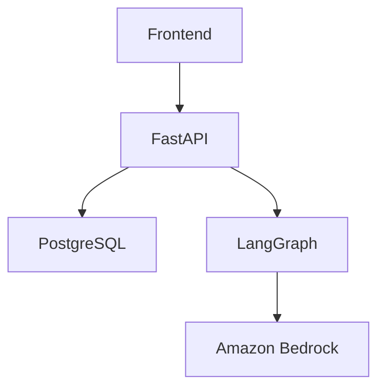

# Negotia

> An Agentic AI platform for realistic negotiation practice and personalized coaching.

Negotia is being developed as an AI-assisted environment where people can practice
realistic negotiation scenarios, interact with specialized AI agents, and receive
structured feedback on their performance. The intended product will help users
identify improvement areas and build negotiation skills through personalized
coaching.

## Why Negotia?

Negotiation is one of the most valuable professional skills, yet realistic practice opportunities are limited. Negotia aims to provide an AI-powered environment where users can repeatedly practice challenging negotiation scenarios, receive objective feedback, and improve through personalized coaching.

Beyond solving this problem, Negotia is also being developed as an AI engineering portfolio project intended to demonstrate modern agentic AI architecture, production-oriented backend design, and cloud-native deployment.

## Current status

Negotia is in active development. The current milestone establishes the backend foundation on which future AI capabilities will be built.

## Current functionality

- FastAPI application titled `Negotia API`, version `0.1.0`
- `GET /api/v1/health` service health check
- Automated pytest coverage for the complete health-check response
- Ruff linting
- uv-based dependency management

## Planned architecture

The following diagram represents the planned high-level architecture. Except for
the current FastAPI foundation, these components are not implemented yet.



## Technology stack

### Backend

**Current**

- Python 3.12+
- FastAPI
- Uvicorn
- pydantic-settings

## AI

**Planned**

- LangGraph
- Amazon Bedrock

## Data

**Planned**

- PostgreSQL

## Developer Experience

**Current**

- uv
- pytest
- Ruff

## Infrastructure & Deployment

**Planned**

- Docker
- AWS

## Project structure

```text
negotia/
|-- app/
|   |-- __init__.py
|   |-- main.py
|   |-- api/
|   |   |-- __init__.py
|   |   `-- v1/
|   |       |-- __init__.py
|   |       |-- health.py
|   |       `-- router.py
|   `-- core/
|       |-- __init__.py
|       `-- config.py
|-- tests/
|   |-- __init__.py
|   `-- api/
|       |-- __init__.py
|       `-- v1/
|           |-- __init__.py
|           `-- test_health.py
|-- .gitignore
|-- .python-version
|-- pyproject.toml
|-- README.md
`-- uv.lock
```

## Local development setup

Install [uv](https://docs.astral.sh/uv/) and run the following commands from the
repository root in Windows PowerShell:

```powershell
uv python install 3.12
uv sync --dev
```

Start the development server:

```powershell
uv run uvicorn app.main:app --reload
```

The API will be available at `http://127.0.0.1:8000`.

## Available API endpoints

| Method | Path | Description |
| --- | --- | --- |
| `GET` | `/api/v1/health` | Reports whether the API service is healthy. |

Successful response:

```json
{
  "status": "healthy",
  "service": "negotia-api"
}
```

## Running tests

Run the automated test suite from Windows PowerShell:

```powershell
uv run pytest
```

The current tests verify that `GET /api/v1/health` returns HTTP `200` with exactly
the documented JSON response and that the unversioned `GET /health` path returns
HTTP `404`.

## Running lint checks

Run Ruff against the application and test code:

```powershell
uv run ruff check app tests
```

## Product roadmap

The planned product direction includes:

- Realistic negotiation scenarios for guided practice
- Specialized AI agents for negotiation interactions
- Structured feedback and personalized coaching
- Performance reviews with clearly identified improvement areas
- PostgreSQL-backed persistence
- LangGraph-based agent workflows
- Amazon Bedrock model integration
- A web frontend
- Docker-based packaging and AWS deployment

These roadmap items describe intended work and are not currently available.

## AI engineering focus

This project is intentionally designed to demonstrate practical AI engineering skills beyond prompt engineering. As development progresses, it will showcase agent orchestration, structured outputs, evaluation pipelines, backend architecture, cloud deployment, and production software engineering practices.

## License status

This repository does not currently include a license file. A project license has
not yet been declared.
