# Negotia

> An agentic AI platform for realistic negotiation practice and personalized coaching.

Negotia is an environment for practicing realistic negotiation scenarios and
building toward structured, personalized coaching. The current backend now
supports its first complete vertical AI slice:

```text
Create scenario
→ create negotiation session
→ submit user turn
→ generate AI opponent response
→ retrieve ordered conversation history
→ explicitly complete the negotiation and receive a structured debrief, strategy,
  and optional cross-session Memory
```

Standalone Coach, debrief, strategy, and memory APIs plus adaptive-difficulty
capabilities remain future work.

## Current status

The Day 5 milestone provides an end-to-end opponent-response workflow through a
versioned FastAPI API. A scenario supplies the negotiation context, a negotiation
session references that scenario, ordered turns capture the conversation, and the
NegotiationEngine coordinates opponent generation and subsequent coach analysis.
OpponentService uses the configured LLM provider to extract the current negotiation
state before generating and persisting the next opponent turn.

The default fake provider makes local development and automated tests deterministic
and does not call AWS. The Bedrock provider is also implemented and can be selected
through environment configuration. DebriefService synthesizes patterns from
stored coach observations only when a client explicitly completes a negotiation.
StrategyService then turns that persisted debrief into actionable recommendations.
MemoryService then generates or reuses an immutable single-user negotiator profile
when at least two persisted Debrief/Strategy pairs exist. The completion response
includes the Debrief, Strategy, and optional historically associated Memory.
AdaptiveContextService provides a read-only runtime projection of the latest
Memory. None of these artifacts has a standalone API.

## Current functionality

- Versioned FastAPI API under `/api/v1`
- Scenario creation, listing, and retrieval
- Negotiation-session creation, listing, and retrieval
- Negotiation-turn creation and retrieval
- Ordered turn history for each negotiation session
- AI opponent-response generation with optional historical Adaptive Context
- Explicit user-triggered negotiation completion
- Idempotent completion responses with stable Debrief, Strategy, and optional
  Memory identifiers and timestamps
- Deterministic orchestration through NegotiationEngine
- Validation that an opponent response follows a user turn
- LLM-assisted structured negotiation-state extraction
- LLM-assisted coach observation extraction with optional historical Adaptive
  Context
- LLM-assisted structured debrief extraction from stored coach observations
- One in-memory debrief record per negotiation session
- LLM-assisted structured Strategy extraction from a persisted debrief
- One in-memory Strategy record per negotiation session
- LLM-assisted cross-session negotiator Memory extraction from persisted Debrief
  and Strategy records
- Immutable in-memory negotiator Memory versions for the single-user MVP
- Read-only Adaptive Context projection derived from the latest negotiator Memory
- Deterministic opponent behavior profiles for each scenario difficulty
- Scenario-aware system prompts and complete-history user prompts
- Deterministic `FakeLLMProvider` for development and testing
- AWS Bedrock Runtime provider using the Converse API
- Configurable `fake` or `bedrock` provider selection
- Public scenario responses that exclude hidden context and walk-away conditions
- Shared in-memory repositories for scenarios, sessions, turns, and coach
  observations
- Centralized configuration, logging, and JSON error responses
- Automated API, domain, service, prompt, provider, and configuration tests

## Implemented architecture

```mermaid
flowchart TD
    API["Versioned FastAPI API"]
    CompletionAPI["Completion API"]
    Config["Application configuration"]
    Factory["LLM provider factory"]
    Engine["NegotiationEngine"]

    subgraph Scenario["Scenario subsystem"]
        ScenarioAPI["Scenario API"]
        ScenarioService["ScenarioService"]
        ScenarioRepository["ScenarioRepository"]
        ScenarioAPI --> ScenarioService
        ScenarioService --> ScenarioRepository
    end

    subgraph Session["Negotiation Session subsystem"]
        SessionAPI["Negotiation API"]
        SessionService["NegotiationService"]
        NegotiationRepository["NegotiationRepository"]
        SessionAPI --> SessionService
        SessionService --> NegotiationRepository
        SessionService -->|"validates scenario"| ScenarioRepository
    end

    subgraph Turn["Negotiation Turn subsystem"]
        TurnAPI["Turn API"]
        TurnService["NegotiationTurnService"]
        TurnRepository["NegotiationTurnRepository"]
        TurnAPI --> TurnService
        TurnService --> TurnRepository
        TurnService -->|"validates session"| NegotiationRepository
    end

    subgraph Opponent["Opponent AI subsystem"]
        OpponentAPI["Opponent-response API"]
        OpponentService["OpponentService"]
        StateExtractor["NegotiationStateExtractor"]
        StatePrompt["NegotiationStatePromptBuilder"]
        ProfileBuilder["OpponentProfileBuilder"]
        PromptBuilder["OpponentPromptBuilder"]

        OpponentService --> StateExtractor
        StateExtractor --> StatePrompt
        OpponentService --> ProfileBuilder
        OpponentService --> PromptBuilder
        OpponentService -->|"loads scenario"| ScenarioRepository
        OpponentService -->|"loads session"| NegotiationRepository
        OpponentService -->|"loads and saves turns"| TurnRepository
    end

    subgraph Coach["Coach subsystem"]
        CoachService["CoachService"]
        CoachExtractor["CoachObservationExtractor"]
        CoachRepository["CoachObservationRepository"]
        CoachPrompt["CoachPromptBuilder"]

        CoachService --> CoachExtractor
        CoachService --> CoachRepository
        CoachExtractor --> CoachPrompt
    end

    subgraph Debrief["Debrief subsystem"]
        DebriefService["DebriefService"]
        DebriefExtractor["DebriefExtractor"]
        DebriefRepository["NegotiationDebriefRepository"]
        DebriefPrompt["DebriefPromptBuilder"]

        DebriefService -->|"loads stored observations"| CoachRepository
        DebriefService --> DebriefExtractor
        DebriefService --> DebriefRepository
        DebriefExtractor --> DebriefPrompt
    end

    subgraph Strategy["Strategy subsystem"]
        StrategyService["StrategyService"]
        StrategyExtractor["StrategyExtractor"]
        StrategyRepository["NegotiationStrategyRepository"]
        StrategyPrompt["StrategyPromptBuilder"]

        StrategyService -->|"loads persisted debrief"| DebriefRepository
        StrategyService --> StrategyExtractor
        StrategyService --> StrategyRepository
        StrategyExtractor --> StrategyPrompt
    end

    subgraph Memory["Memory subsystem"]
        MemoryService["MemoryService"]
        MemoryExtractor["MemoryExtractor"]
        MemoryRepository["NegotiatorMemoryRepository"]
        MemoryPrompt["MemoryPromptBuilder"]

        StrategyRepository --> MemoryService
        DebriefRepository --> MemoryService
        MemoryService --> MemoryExtractor
        MemoryService --> MemoryRepository
        MemoryExtractor --> MemoryPrompt
    end

    subgraph Adaptive["Adaptive Context subsystem"]
        AdaptiveContextService["AdaptiveContextService"]
        AdaptiveContext["AdaptiveContext"]

        MemoryService -->|"latest memory"| AdaptiveContextService
        AdaptiveContextService --> AdaptiveContext
    end

    CoachService -->|"loads optional coaching context"| AdaptiveContextService
    OpponentService -->|"loads optional opponent context"| AdaptiveContextService

    Provider["LLMProvider protocol"]
    Fake["FakeLLMProvider"]
    Bedrock["BedrockLLMProvider"]

    API --> ScenarioAPI
    API --> SessionAPI
    API --> TurnAPI
    API --> OpponentAPI
    API --> CompletionAPI
    OpponentAPI --> Engine
    CompletionAPI --> Engine
    Engine -->|"request / response result"| OpponentService
    Engine -->|"complete ordered history"| CoachService
    Engine -->|"validate ordered turns"| TurnService
    Engine -->|"retrieve or generate debrief"| DebriefService
    Engine -->|"retrieve or generate strategy"| StrategyService
    Engine -->|"retrieve or generate eligible memory"| MemoryService
    Engine -->|"mark completed"| SessionService

    Config --> Factory
    Factory -->|"LLM_PROVIDER=fake"| Fake
    Factory -->|"LLM_PROVIDER=bedrock"| Bedrock

    OpponentService --> Provider
    StateExtractor --> Provider
    CoachExtractor --> Provider
    DebriefExtractor --> Provider
    StrategyExtractor --> Provider
    MemoryExtractor --> Provider
    Fake -.->|"implements"| Provider
    Bedrock -.->|"implements"| Provider
```



Repositories are instantiated once for the application and shared by the services
that need them. This lets an opponent response observe scenarios, sessions, and
turns created through the API, while CoachService retains append-only observations
for completed exchanges. DebriefService reads only those stored observations and
persists at most one synthesized debrief per session. NegotiationEngine invokes it
only after an explicit completion request passes session and turn validation.
StrategyService reads only a persisted NegotiationDebriefRecord and stores at most
one strategy per session. NegotiationEngine invokes it after the debrief is
available and before marking the session completed.
MemoryService lists persisted strategies, resolves the corresponding debriefs by
session ID, and stores each eligible profile as a new immutable version.
NegotiationEngine invokes it after Strategy is available and before marking the
session completed. Each completion-triggered version is associated internally
with its triggering session.
AdaptiveContextService depends only on MemoryService. It reads the latest Memory
on every request and projects selected fields into a new immutable runtime
context without persistence, caching, LLM calls, or repository access.

## End-to-end opponent workflow

1. Create a scenario.
2. Create a negotiation session linked by `scenario_id`.
3. Submit a user turn.
4. Request an opponent response; the API delegates to NegotiationEngine.
5. NegotiationEngine delegates opponent generation to OpponentService.
6. Load the session, referenced scenario, and ordered turn history.
7. Build a state-extraction prompt from the complete ordered history.
8. Call the configured LLM provider and validate its JSON as NegotiationState.
9. Derive a deterministic behavior profile from the scenario difficulty.
10. Load the latest optional Adaptive Context once.
11. Build the opponent system prompt with the state, behavior profile, and only
    relevant opponent adjustments while retaining the complete history in the user
    prompt. Scenario constraints remain authoritative.
12. When no Memory exists, use the standard opponent prompt without an adaptive
    section.
13. Call the configured LLM provider for the opponent response.
14. Strip and validate the generated response.
15. Save it as the next numbered opponent turn and return it with the complete
    ordered conversation history.
16. NegotiationEngine passes the complete history and latest exchange to
    CoachService.
17. CoachService loads the latest optional Adaptive Context once, then extracts and
    persists one observation linked to the user and opponent turn IDs. Historical
    context guides attention, while current-session evidence remains authoritative.
18. When no Memory exists, CoachService follows the standard non-adaptive prompt
    path without rendering a historical-context section.
19. NegotiationEngine ignores the internal observation record and returns only the
    opponent turn to the API.

## Explicit completion workflow

1. The client explicitly requests completion; negotiation content and LLM output
   never complete a session automatically.
2. NegotiationEngine validates the session, ordered turns, latest opponent turn,
   an adjacent user-opponent exchange, and available coach observations.
3. DebriefService reuses an existing debrief or generates one only from stored
   CoachObservationRecords.
4. StrategyService reuses an existing strategy or generates one only from the
   persisted debrief.
5. MemoryService reuses the Memory associated with this completion, generates a
   new version when at least two complete artifact pairs exist, or returns no
   Memory when history is still insufficient.
6. NegotiationService transitions `created` or `active` to `completed` and updates
   `updated_at`, which is returned as `completed_at`.
7. Repeated completion calls return the original timestamp, Debrief, Strategy,
   and historically associated optional Memory without revalidating turns or
   calling the LLM again.

Illustrative conversation:

```text
Turn 1 — User:
We need a ten percent reduction to renew this year.

Turn 2 — Opponent:
A ten percent reduction would be difficult, but I may be able to consider a
smaller adjustment for a longer commitment.
```

This example illustrates the intended interaction and is not a guaranteed model
output.

## Domain model

### Scenario

A Scenario defines the opponent role, objective, difficulty, personality,
negotiation style, constraints, private context, and walk-away conditions. Public
`ScenarioResponse` objects intentionally exclude private context and walk-away
conditions.

### Negotiation session

A NegotiationSession references a Scenario by `scenario_id` and tracks its status
and timestamps.

### Negotiation turn

A NegotiationTurn references a session by `session_id`, identifies the user or
opponent speaker, stores the message content, and carries a session-specific turn
number. Session history is returned in turn-number order.

### Opponent profile

An OpponentProfile translates the scenario's fixed difficulty into deterministic
guidance for resistance, concessions, disclosure, tactics, pressure, mistake
tolerance, and boundary discipline. These profiles shape the system prompt while
keeping every difficulty professional and respectful.

### Negotiation state

NegotiationState is an immutable, in-memory result extracted from the complete
turn history before each opponent response. It records the latest user and
opponent positions, agreements, open topics, unresolved items, and negotiation
stage. The state supplements the raw history and is not persisted.

### Coach observation

CoachObservation contains evidence-based strengths, weaknesses, missed
opportunities, risk signals, and a confidence value extracted from the ordered
conversation. The coach analyzes only the user's behavior, does not participate
in the negotiation, and persists each observation inside an immutable
CoachObservationRecord linked to the completed user-opponent exchange.
When available, the latest Adaptive Context supplies historical focus areas,
coaching focus, and recurring strengths to guide observation. The prompt requires
current-session evidence and does not treat historical tendencies as proof of
current behavior.

### Negotiation debrief

NegotiationDebrief synthesizes repeated strengths, repeated weaknesses, important
missed opportunities, recurring risks, an overall assessment, and confidence from
stored CoachObservationRecords. It does not receive or re-read raw conversation
turns or scenario data. An immutable NegotiationDebriefRecord stores the composed
debrief, source-observation count, session ID, and creation time. Generation is
triggered only by the explicit negotiation-completion endpoint. There is no
automatic completion inference or standalone debrief retrieval endpoint.

### Negotiation strategy

NegotiationStrategy converts one persisted NegotiationDebriefRecord into a
primary objective, expected outcome, prioritized actionable tactics, long-term
skills, preparation checklist, avoidance guidance, and confidence. Each tactic
contains concrete actions, example language, and a success indicator. Strategy
does not receive turns, coach observations, scenarios, negotiation state, or
session repositories. It is generated or reused during explicit completion and
returned as a strongly typed part of the completion response.

### Negotiator memory

NegotiatorMemory identifies cross-session strengths, weaknesses, improving
skills, persistent risks, priority focus areas, and recommended drills using only
persisted NegotiationDebriefRecord and NegotiationStrategyRecord pairs. Each
NegotiatorMemoryRecord stores the sorted source session IDs and a UTC creation
time. Records form an append-only version history for the current single-user
MVP. Completion generates a version only when at least two complete artifact
pairs exist, so the first eligible negotiation can return no Memory. Each
completion-triggered record retains internal trigger lineage, and repeated
completion returns that historical version rather than the latest global one.
Memory still has no public endpoint.

### Adaptive context

AdaptiveContext is a read-only runtime projection of the latest
NegotiatorMemoryRecord. It exposes priority focus areas, improving skills as
coaching focus, persistent risks as opponent adjustments, and recurring
strengths. Every projection defensively copies its lists and is rebuilt from the
latest Memory rather than cached. CoachService now reads this projection once per
observation and renders only coaching-relevant fields; no Memory preserves the
standard Coach prompt. OpponentService independently renders only opponent
adjustments as optional risk-testing guidance. These adjustments create realistic
opportunities rather than predetermined failure, never override scenario
constraints, and must not reveal historical knowledge during the simulation. No
Memory preserves the standard Opponent prompt. The projection has no public
endpoint.

## Technology stack

- Python 3.12+
- FastAPI and Uvicorn
- Pydantic v2 and pydantic-settings
- boto3 and AWS Bedrock Runtime
- Python standard-library logging
- pytest, FastAPI TestClient, and HTTPX
- Ruff
- uv

## Project structure

```text
negotia/
|-- app/
|   |-- api/
|   |   |-- dependencies.py
|   |   `-- v1/
|   |       |-- health.py
|   |       |-- negotiations.py
|   |       |-- router.py
|   |       |-- scenarios.py
|   |       `-- turns.py
|   |-- aws/
|   |   `-- session.py
|   |-- core/
|   |   |-- config.py
|   |   |-- exception_handlers.py
|   |   |-- exceptions.py
|   |   `-- logging_config.py
|   |-- domains/
|   |   |-- adaptive_context/
|   |   |-- coach/
|   |   |-- debrief/
|   |   |-- memory/
|   |   |-- negotiation/
|   |   |-- negotiation_state/
|   |   |-- negotiation_turn/
|   |   |-- opponent/
|   |   |-- scenario/
|   |   `-- strategy/
|   |-- llm/
|   |   |-- bedrock.py
|   |   |-- factory.py
|   |   |-- fake.py
|   |   `-- provider.py
|   |-- prompts/
|   |   |-- coach.py
|   |   |-- debrief.py
|   |   |-- memory.py
|   |   |-- negotiation_state.py
|   |   |-- opponent.py
|   |   `-- strategy.py
|   |-- services/
|   |   |-- adaptive_context.py
|   |   |-- coach.py
|   |   |-- debrief.py
|   |   |-- memory.py
|   |   |-- negotiation_engine.py
|   |   |-- negotiation_state.py
|   |   |-- opponent.py
|   |   `-- strategy.py
|   `-- main.py
|-- tests/
|-- .env.example
|-- .gitignore
|-- .python-version
|-- pyproject.toml
|-- README.md
`-- uv.lock
```

Package marker files are omitted for brevity.

## Local development

Install [uv](https://docs.astral.sh/uv/), then run these commands from the
repository root:

```powershell
uv python install 3.12
uv sync --dev
Copy-Item .env.example .env
```

The `.env` copy is optional when the defaults are suitable.

## LLM provider configuration

The application loads `.env` using UTF-8 encoding. The provider-related defaults
in `.env.example` are:

```dotenv
LLM_PROVIDER=fake
BEDROCK_MODEL_ID=amazon.nova-lite-v1:0
AWS_REGION=us-east-1
AWS_PROFILE=
```

- `fake` is the default and returns a deterministic response without making AWS
  calls.
- `bedrock` enables real generation through AWS Bedrock Runtime.
- `BEDROCK_MODEL_ID` selects the Bedrock model used by the Converse request.
- `AWS_REGION` is always supplied when creating the AWS session.
- `AWS_PROFILE` is optional. When it is empty, boto3 uses the normal AWS
  credential chain, including IAM roles on EC2. When set, the named local profile
  is used.

AWS credentials are not stored in this repository. Do not place access keys or
secret keys in `.env.example`.

Other supported settings are:

| Environment variable | Default |
| --- | --- |
| `APP_NAME` | `Negotia API` |
| `API_VERSION` | `0.1.0` |
| `DEBUG` | `false` |

## Running the API

```powershell
uv run uvicorn app.main:app --reload
```

The API is available at `http://127.0.0.1:8000`.

## Available API endpoints

| Method | Path | Description |
| --- | --- | --- |
| `GET` | `/api/v1/health` | Report API health. |
| `POST` | `/api/v1/scenarios` | Create a scenario. |
| `GET` | `/api/v1/scenarios` | List scenarios. |
| `GET` | `/api/v1/scenarios/{scenario_id}` | Retrieve a scenario. |
| `POST` | `/api/v1/negotiations` | Create a negotiation session for an existing scenario. |
| `GET` | `/api/v1/negotiations` | List negotiation sessions. |
| `GET` | `/api/v1/negotiations/{session_id}` | Retrieve a negotiation session. |
| `POST` | `/api/v1/turns` | Create a user or opponent turn for an existing session. |
| `GET` | `/api/v1/turns/{turn_id}` | Retrieve a turn. |
| `GET` | `/api/v1/negotiations/{session_id}/turns` | Retrieve ordered session history. |
| `POST` | `/api/v1/negotiations/{session_id}/opponent-response` | Generate and store the next opponent turn. |
| `POST` | `/api/v1/negotiations/{session_id}/complete` | Explicitly complete a negotiation and return its persisted Debrief, Strategy, and optional Memory. |

The opponent-response endpoint requires an existing user turn. It returns `409`
when there is no user turn or when the latest turn already belongs to the
opponent.

The completion endpoint requires at least one completed user-opponent exchange,
an opponent latest turn, and a persisted coach observation. Repeated successful
completion requests are idempotent.

The unversioned `GET /health` path returns `404`. Error responses use the
application's consistent JSON envelope:

```json
{
  "error": {
    "code": "not_found",
    "message": "Not Found"
  }
}
```

## Running tests

```powershell
uv run pytest
```

The test suite uses the fake provider for API and service workflows and mocks AWS
client creation in Bedrock-specific tests. It does not require live AWS access.

## Running code-quality checks

```powershell
uv run ruff check .
uv run ruff format --check .
```

## Current limitations

- Repositories are in memory, so all data is lost when the application restarts.
- Negotiation state is re-extracted for each opponent response and is not persisted
  or incrementally updated.
- Coach observations are persisted only in memory and are not returned by the API
  or available through a retrieval endpoint.
- Debriefs are persisted only in memory and are exposed only as part of the
  explicit completion response; no standalone retrieval endpoint exists.
- In-memory repositories do not provide a transaction spanning debrief and
  strategy persistence and the session-status update. A retry reuses artifacts
  persisted before a later completion step failed.
- Strategies are persisted only in memory and have no standalone retrieval API.
- Negotiator Memory is versioned only in memory, is scoped to the single-user MVP,
  and has no standalone API.
- Authentication and authorization are not implemented.
- Adaptive difficulty is not implemented.
- Opponent quality depends on the selected provider, model, scenario data, and
  prompt design.
- The current backend does not include a web frontend or durable database.
- Production deployment infrastructure is not yet included.

## Roadmap

Completed:

- [x] FastAPI application foundation and versioned API
- [x] Scenario domain and API
- [x] Negotiation-session domain and API
- [x] Negotiation-turn domain and API
- [x] LLM provider abstraction and deterministic fake provider
- [x] AWS Bedrock provider and configuration-based provider selection
- [x] Scenario-aware opponent prompt builder
- [x] Deterministic opponent behavior profiles by scenario difficulty
- [x] LLM-assisted structured negotiation-state extraction
- [x] Coach observation extraction, service, and per-exchange persistence
- [x] Structured debrief extraction and in-memory per-session persistence
- [x] Deterministic NegotiationEngine orchestration layer
- [x] Opponent service and opponent-response API
- [x] Explicit, idempotent negotiation completion with debrief and strategy response
- [x] Standalone structured Strategy extraction and in-memory persistence
- [x] Strategy integration with negotiation completion
- [x] Isolated cross-session negotiator Memory extraction and version persistence
- [x] Trigger-linked Memory integration with explicit negotiation completion
- [x] Read-only Adaptive Context projection from latest Memory
- [x] Coach Adaptive Integration using optional historical context
- [x] Opponent Adaptive Integration using optional historical risk testing

Planned:

- [ ] Richer multi-round opponent behavior
- [ ] Standalone Coach, debrief, strategy, and memory APIs
- [ ] LangGraph orchestration
- [ ] Adaptive difficulty
- [ ] Durable authenticated negotiator profiles
- [ ] Persistent database
- [ ] Authentication and authorization
- [ ] Web frontend and production deployment

## License status

This repository does not currently include a license file. A project license has
not yet been declared.
