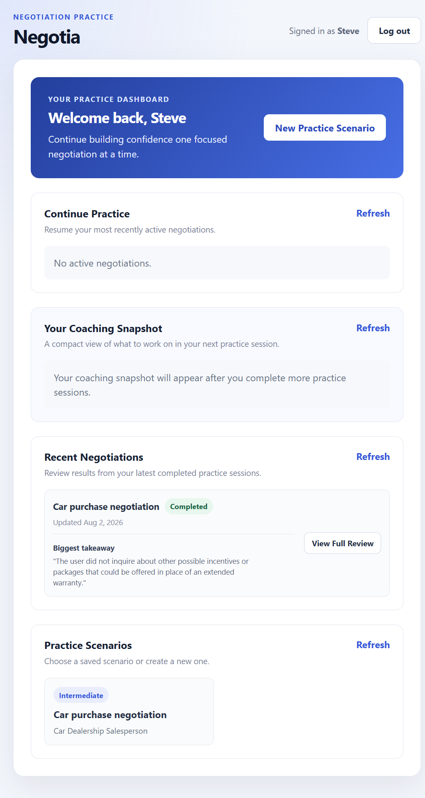
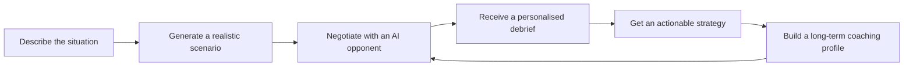
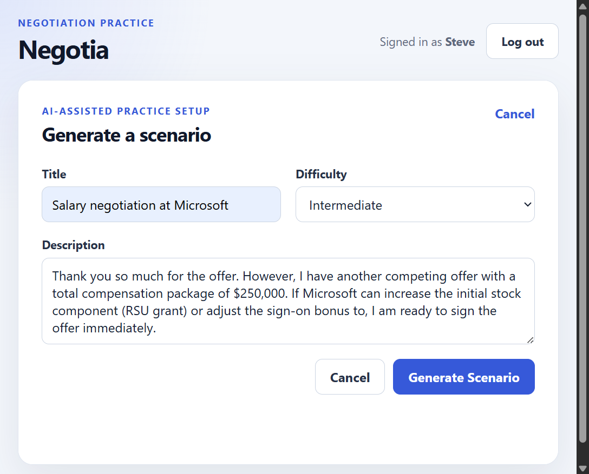
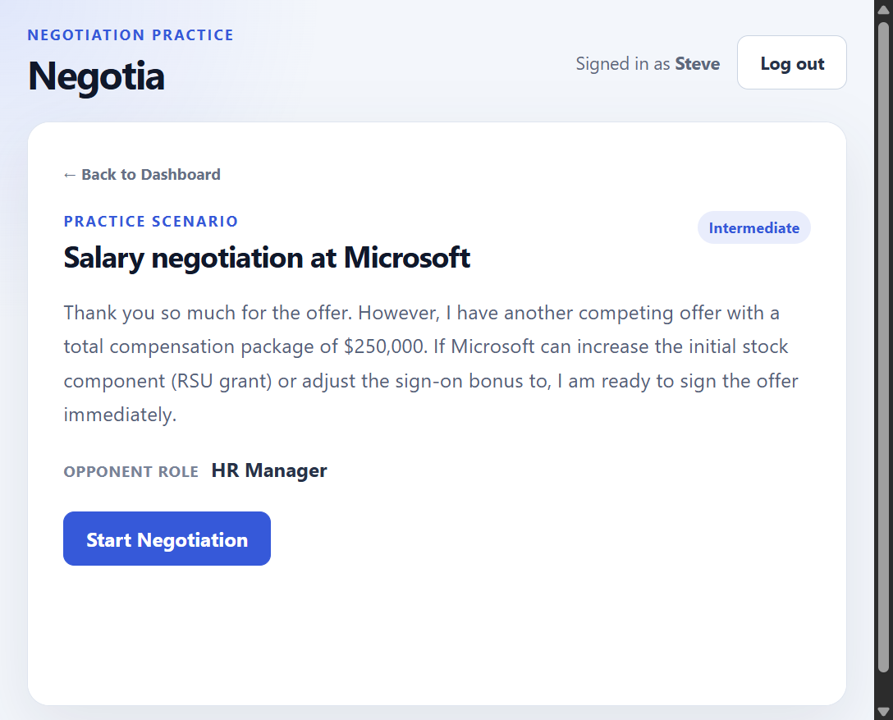
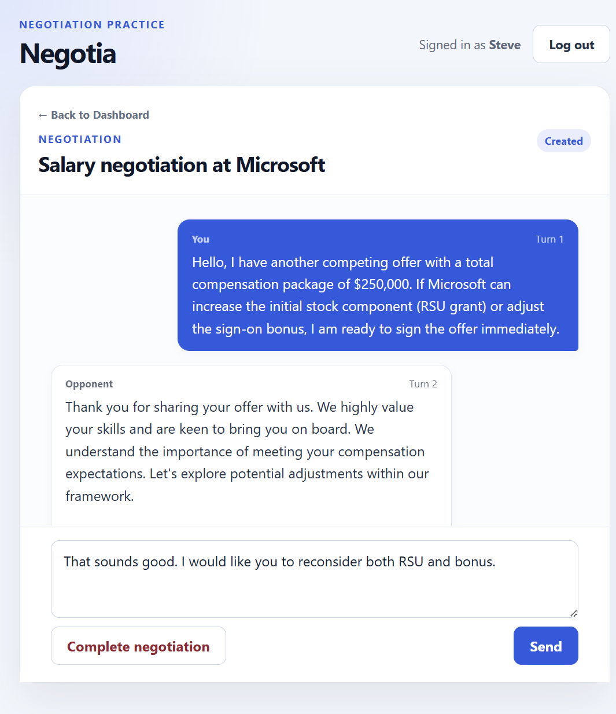
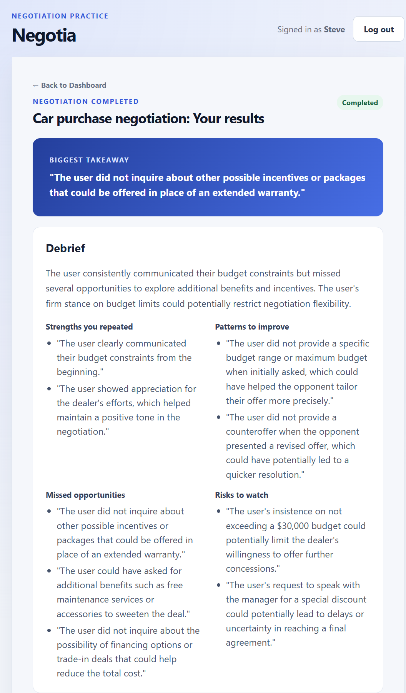
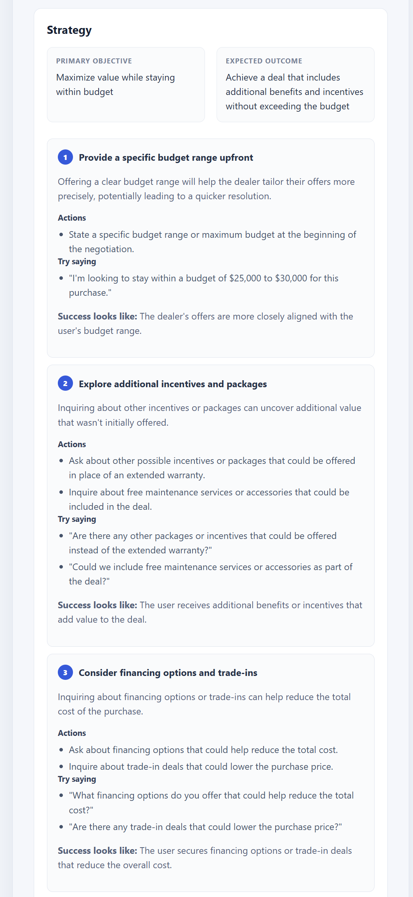
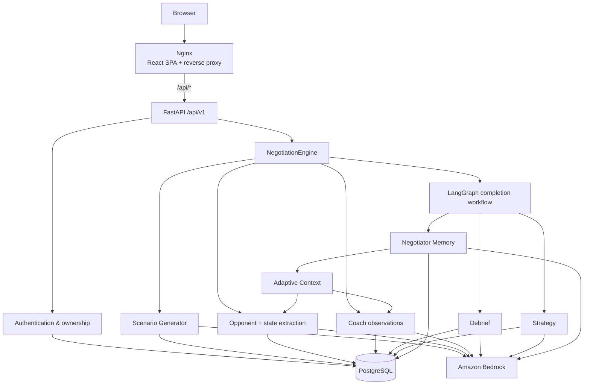
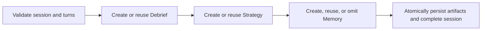
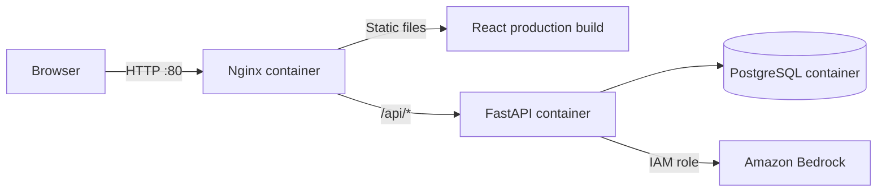

<div align="center">

# Negotia

### Agentic AI Negotiation Coach

**Practice before the stakes are real.**

Master salary negotiations, promotions, client conversations, vendor discussions, and business deals through realistic AI-powered practice.

[🌐 Live Demo](http://54.227.221.0/) · [🎬 Product Demo](docs/images/negotia-demo.mp4) · [🏗️ Architecture](#architecture) · [🚀 Quick Start](#quick-start)

</div>

---

## See Negotia in action

[▶ Watch the product demo](docs/images/negotia-demo.mp4)

<p align="center">
  
</p>

---

## Why Negotia?

Negotiation is one of the most valuable professional skills, yet most people only practise it when something important is already on the line: a salary offer, promotion, client contract, vendor agreement, or business partnership.

Traditional role-play requires another person. Professional coaching is expensive. Static simulations quickly become predictable.

Negotia provides a safe place to practise realistic conversations, receive structured coaching, and improve across repeated sessions.

---

## The complete coaching loop



A user starts with only a title, difficulty level, and short description. Negotia generates the hidden negotiation context, simulates the other party, evaluates the user's behaviour, and converts the completed session into practical coaching.

---

## Product walkthrough

### 1. Generate a scenario

<p align="center">
  
</p>

The public form stays intentionally simple. Internal scenario details—such as opponent constraints, private context, and walk-away conditions—are generated by the AI and kept out of the user's setup flow.

### 2. Review the generated scenario

<p align="center">
  
</p>

### 3. Negotiate in real time

<p align="center">
  
</p>

Opponent responses stream incrementally through the UI. The complete response is persisted only after the stream finishes successfully.

### 4. Receive a personalised debrief

<p align="center">
  
</p>

### 5. Leave with an actionable strategy

<p align="center">
  
</p>

---

## What makes Negotia different?

| Capability | What it delivers |
|---|---|
| **AI-generated scenarios** | Realistic negotiation settings from a short user description |
| **Adaptive AI opponent** | Scenario-aware responses shaped by difficulty, conversation state, and relevant historical risks |
| **Streaming conversation** | Incremental opponent responses through newline-delimited JSON |
| **Silent coaching** | Evidence-based observations captured after each completed exchange |
| **Structured debrief** | Repeated strengths, weaknesses, missed opportunities, risks, and an overall assessment |
| **Actionable strategy** | Prioritised tactics, concrete actions, example language, and preparation guidance |
| **Cross-session memory** | A compact coaching profile that identifies stable patterns and the next skill to practise |
| **Secure multi-user design** | Authentication, ownership, and anti-enumeration across negotiation resources |
| **Production deployment** | React, FastAPI, PostgreSQL, Docker, Nginx, AWS EC2, and Amazon Bedrock |

---

## Why this is agentic AI

Negotia is best described as an **agentic AI system with deterministic orchestration**.

The high-level workflow is intentionally controlled by application logic for reliability, while specialised LLM-powered components perform distinct reasoning tasks.

| AI component | Responsibility |
|---|---|
| **Scenario Generator** | Expands a simple request into a complete negotiation environment |
| **Opponent** | Interprets the conversation and responds as the other party |
| **Coach** | Observes the user's behaviour without interrupting the negotiation |
| **Debrief** | Synthesises patterns from persisted coach observations |
| **Strategy** | Converts the debrief into an improvement plan |
| **Memory** | Compares completed sessions and builds a long-term coaching profile |

The model does not dynamically choose the next system node. A deterministic engine and a linear LangGraph completion workflow coordinate specialised reasoning components, persistence, validation, and idempotency.

This provides agentic behaviour without overstating the system as a fully autonomous multi-agent platform.

---

## Engineering highlights

### Reliable structured generation

Scenario data, negotiation state, coach observations, debriefs, strategies, and memory are validated as strict Pydantic models. Invalid JSON, missing fields, extra fields, and empty model output fail safely instead of leaking malformed data into the application.

### Streaming with persistence safety

The Bedrock provider uses `converse_stream`. The API forwards events as `application/x-ndjson`, while the frontend incrementally decodes split UTF-8 and JSON chunks into one temporary message bubble.

A streamed opponent turn is persisted only after successful, nonblank completion. Interrupted partial text is removed, leaving the user's persisted turn available for retry.

### Cross-session coaching memory

Negotiator Memory V2 compares completed sessions chronologically, compresses semantically overlapping feedback, and produces a bounded profile containing stable strengths, stable weaknesses, improving skills, persistent risks, one highest-priority skill, one next-session drill, and a concise progress summary.

The latest memory is projected into adaptive context for both the Coach and Opponent without exposing private historical details inside the simulation.

### Transactional completion

LLM generation occurs outside the database transaction. Final persistence occurs inside a short completion-scoped Unit of Work that locks the negotiation by `session_id` and authenticated `user_id`, then atomically persists the Debrief, Strategy, optional Memory, and completed session status.

Repeated completion requests are idempotent and return the originally persisted artifacts without repeated model calls.

### Authentication and ownership

Negotia supports username/password registration, bcrypt password hashing, expiring JWT access tokens, authenticated current-user resolution, user-scoped resources, ownership derived through negotiation sessions, and not-found behaviour for both missing and unauthorised resources.

### Production-ready delivery

The production topology exposes only Nginx on port 80. FastAPI and PostgreSQL remain private inside the Docker Compose network. Nginx serves the compiled React application, proxies same-origin `/api/*` requests, and disables proxy buffering so streamed responses reach the browser immediately.

---

## Architecture

### Application architecture



### Completion workflow



### Production deployment



---

## Technology stack

| Layer | Technologies |
|---|---|
| **Frontend** | React 19, TypeScript, Vite, native Fetch API, plain CSS |
| **Backend** | Python 3.12, FastAPI, Uvicorn, Pydantic v2 |
| **AI orchestration** | NegotiationEngine, LangGraph, strict structured-output parsing |
| **LLM providers** | Amazon Bedrock Runtime and deterministic fake provider |
| **Persistence** | PostgreSQL 17, SQLAlchemy 2, psycopg, Alembic |
| **Authentication** | bcrypt password hashing, PyJWT bearer tokens |
| **Infrastructure** | Docker, Docker Compose, Nginx, AWS EC2, EC2 IAM role |
| **Quality** | pytest, HTTPX, Ruff, Pyright, frontend type checking and build validation |

---

## Project structure

```text
negotia/
├── app/
│   ├── api/                    # FastAPI dependencies and versioned routes
│   ├── aws/                    # AWS session construction
│   ├── core/                   # Configuration, errors, logging, observability
│   ├── database/               # SQLAlchemy models, repositories, sessions
│   ├── domains/                # Domain models, schemas, repositories, exceptions
│   ├── llm/                    # Provider protocol, Bedrock, fake provider
│   ├── prompts/                # Structured prompts for each AI responsibility
│   ├── services/               # Application and AI services
│   ├── workflows/              # LangGraph completion workflow
│   └── main.py
├── frontend/
│   ├── src/                    # React application
│   ├── Dockerfile
│   └── nginx.conf
├── alembic/                    # Database migrations
├── scripts/                    # EC2 deployment and PostgreSQL backup helpers
├── tests/                      # API, service, domain, provider, and deployment tests
├── compose.yaml
├── compose.production.yaml
├── Dockerfile
├── pyproject.toml
└── uv.lock
```

---

## Quick start

### Prerequisites

- Python 3.12
- [uv](https://docs.astral.sh/uv/)
- Docker with Docker Compose
- Node.js and pnpm for frontend development

### 1. Clone and configure

```powershell
git clone https://github.com/bikash-singhal/negotia.git
Set-Location negotia

uv python install 3.12
uv sync --dev

Copy-Item .env.example .env
Copy-Item frontend/.env.example frontend/.env
```

### 2. Start PostgreSQL and migrate

```powershell
docker compose up -d database
uv run alembic upgrade head
```

### 3. Start the API

```powershell
uv run uvicorn app.main:app --reload
```

The local API runs at `http://127.0.0.1:8000`.

### 4. Start the frontend

```powershell
Set-Location frontend
pnpm install
pnpm dev
```

Open `http://localhost:5173`.

---

## LLM provider configuration

The default provider is deterministic and does not call AWS:

```dotenv
LLM_PROVIDER=fake
BEDROCK_MODEL_ID=amazon.nova-lite-v1:0
AWS_REGION=us-east-1
AWS_PROFILE=
```

Set `LLM_PROVIDER=bedrock` to use Amazon Bedrock.

Locally, boto3 can use a named profile through `AWS_PROFILE`. On EC2, leave it empty and attach an IAM role with only the required Bedrock model-invocation permissions.

AWS access keys and secret keys are not stored in this repository.

---

## Running with Docker Compose

```powershell
Copy-Item .env.example .env
docker compose build api
docker compose up -d --wait
```

Inspect services and logs:

```powershell
docker compose ps
docker compose logs -f api
```

Stop the stack without deleting PostgreSQL data:

```powershell
docker compose down
```

Do not add `--volumes` when the database must be retained.

---

## Production deployment on EC2

The included production Compose override runs three containers on one Ubuntu EC2 instance:

- `frontend`: Nginx serving the React build and proxying `/api/*`
- `api`: FastAPI, available only inside the Compose network
- `database`: PostgreSQL, available only inside the Compose network

Only the frontend publishes a host port.

### Configure the instance

```bash
git clone https://github.com/bikash-singhal/negotia.git
cd negotia
cp .env.production.example .env.production
chmod 600 .env.production
```

Replace the production database password and JWT secret with strong random values. Keep `VITE_API_BASE_URL=/api/v1`.

Attach an EC2 IAM role for Bedrock rather than storing AWS credentials on the server.

Recommended inbound rules:

- SSH `22` only from the administrator's trusted IP
- HTTP `80` for intended users
- do not expose `8000` or `5432`

### Deploy

```bash
bash scripts/backup-postgres.sh
bash scripts/deploy-ec2.sh
```

The deployment script performs a fast-forward-only pull, validates Compose, builds both images, runs migrations during API startup, waits for healthy services, prints logs on failure, and never removes the PostgreSQL volume.

> The live deployment currently uses plain HTTP. HTTPS, domain routing, and automated off-instance backups remain future infrastructure work.

---

## API overview

| Method | Path | Purpose |
|---|---|---|
| `GET` | `/api/v1/health` | API health |
| `POST` | `/api/v1/auth/register` | Register a user |
| `POST` | `/api/v1/auth/login` | Authenticate and receive a token |
| `GET` | `/api/v1/auth/me` | Retrieve the current user |
| `POST` | `/api/v1/scenarios` | Generate and persist a scenario |
| `GET` | `/api/v1/scenarios` | List the current user's scenarios |
| `GET` | `/api/v1/scenarios/{scenario_id}` | Retrieve a scenario |
| `POST` | `/api/v1/negotiations` | Create a negotiation session |
| `GET` | `/api/v1/negotiations` | List negotiation sessions |
| `GET` | `/api/v1/negotiations/{session_id}` | Retrieve a session |
| `POST` | `/api/v1/turns` | Persist a negotiation turn |
| `GET` | `/api/v1/turns/{turn_id}` | Retrieve a turn |
| `GET` | `/api/v1/negotiations/{session_id}/turns` | Retrieve ordered history |
| `POST` | `/api/v1/negotiations/{session_id}/opponent-response` | Generate a non-streaming opponent turn |
| `POST` | `/api/v1/negotiations/{session_id}/opponent-response/stream` | Stream and persist an opponent turn |
| `POST` | `/api/v1/negotiations/{session_id}/complete` | Complete a session and return coaching artifacts |
| `GET` | `/api/v1/memory/latest` | Retrieve the current user's latest coaching profile |

Health, registration, and login are public. All other routes require a bearer token.

---

## Testing and quality checks

```powershell
uv run pytest
uv run ruff check .
uv run ruff format --check .
uv run pyright

Set-Location frontend
pnpm typecheck
pnpm test
pnpm build
```

The project includes API, domain, service, prompt, provider, ownership, persistence, streaming, transaction, and deployment tests. The fake provider keeps normal automated tests deterministic and independent of live AWS access.

---

## Current limitations

- The live deployment uses an EC2 public IP over HTTP, without a custom domain or TLS.
- Browser authentication uses an access token in `localStorage`; refresh tokens, revocation, password reset, and email verification are not implemented.
- The completion graph is synchronous and linear; it does not currently use checkpointing, conditional routing, or human-in-the-loop controls.
- Negotiator Memory is user-scoped and versioned, but only the latest profile is exposed through the public API.
- Coach observations, Debriefs, and Strategies do not have standalone retrieval APIs.
- Adaptive difficulty is not yet implemented.
- The deployment is single-instance and does not include a load balancer, horizontal scaling, or automated off-instance backups.
- Opponent and coaching quality depend on the selected model, prompts, scenario context, and available session history.

---

## Roadmap

### Completed

- [x] Versioned FastAPI application
- [x] React and TypeScript frontend
- [x] Username/password authentication with JWT
- [x] Per-user ownership and anti-enumeration
- [x] AI-generated negotiation scenarios
- [x] Scenario-aware opponent generation
- [x] Structured negotiation-state extraction
- [x] Streaming opponent responses
- [x] Silent coach observations
- [x] Structured Debrief and Strategy generation
- [x] Cross-session Negotiator Memory V2
- [x] Adaptive context for Coach and Opponent
- [x] LangGraph completion orchestration
- [x] Completion-scoped Unit of Work
- [x] PostgreSQL persistence and Alembic migrations
- [x] Dockerised local and production execution
- [x] Nginx production frontend and reverse proxy
- [x] AWS EC2 and Amazon Bedrock deployment

### Planned

- [ ] Adaptive difficulty
- [ ] Richer multi-round opponent tactics
- [ ] Voice-based negotiation practice
- [ ] Standalone coaching-artifact and memory-history APIs
- [ ] Editable user profiles
- [ ] HTTPS and custom domain
- [ ] Automated off-instance backups
- [ ] Multi-instance production architecture

---

## License

This repository does not currently include a licence file. No project licence has been declared yet.
