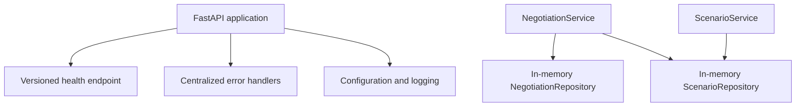

# Negotia

> An agentic AI platform for realistic negotiation practice and personalized coaching.

Negotia is being developed as an environment for practicing negotiation scenarios
and receiving structured, personalized coaching. The repository currently contains
the backend and domain foundation only; negotiation APIs, AI agents, persistence,
and a web interface are not implemented yet.

## Current status

The current milestone provides:

- A FastAPI application titled `Negotia API`, version `0.1.0`
- Versioned API routing with `GET /api/v1/health`
- Environment-based configuration through `pydantic-settings`
- Standard-library console logging and application lifespan logs
- Centralized JSON handlers for application, HTTP, validation, and unexpected errors
- Scenario models, schemas, an in-memory repository, and a service
- Negotiation-session models, schemas, an in-memory repository, and a service
- Scenario-existence validation before negotiation-session creation
- Automated API and domain-layer tests
- uv dependency management and Ruff linting

The Scenario and Negotiation domain services are not exposed through API routes.
Their repositories store data in memory, so data does not survive process restarts.

## Implemented architecture



The domain services and repositories are currently tested directly and are not yet
wired into FastAPI.

## Domain model

### Scenario

A Scenario contains the negotiation setup, including its industry, opponent role,
objective, difficulty, constraints, personality, negotiation style, private
context, and walk-away conditions.

`ScenarioResponse` intentionally excludes `hidden_context` and
`walk_away_conditions`. `ScenarioInternalResponse` includes the complete domain
state for trusted internal use.

### Negotiation session

A NegotiationSession references a Scenario by `scenario_id` and tracks its status
and timestamps. `NegotiationService` verifies that the referenced Scenario exists
before creating and storing a session. A missing Scenario raises the domain-level
`ScenarioNotFoundError`.

## Technology stack

### Current

- Python 3.12+
- FastAPI and Uvicorn
- Pydantic v2 and pydantic-settings
- Python standard-library logging
- pytest, FastAPI TestClient, and HTTPX
- Ruff
- uv

### Planned

- PostgreSQL
- LangGraph
- Amazon Bedrock
- Evaluation and observability tooling
- A web frontend
- Docker and AWS deployment

Planned technologies are not implemented in the current repository.

## Project structure

```text
negotia/
|-- app/
|   |-- api/
|   |   `-- v1/
|   |       |-- health.py
|   |       `-- router.py
|   |-- core/
|   |   |-- config.py
|   |   |-- exception_handlers.py
|   |   |-- exceptions.py
|   |   `-- logging_config.py
|   |-- domains/
|   |   |-- negotiation/
|   |   |   |-- exceptions.py
|   |   |   |-- models.py
|   |   |   |-- repository.py
|   |   |   |-- schemas.py
|   |   |   `-- service.py
|   |   `-- scenario/
|   |       |-- models.py
|   |       |-- repository.py
|   |       |-- schemas.py
|   |       `-- service.py
|   `-- main.py
|-- tests/
|   |-- api/
|   |   `-- v1/
|   |       `-- test_health.py
|   `-- domains/
|       |-- negotiation/
|       |   |-- test_repository.py
|       |   |-- test_schemas.py
|       |   `-- test_service.py
|       `-- scenario/
|           |-- test_models.py
|           |-- test_repository.py
|           |-- test_schemas.py
|           `-- test_service.py
|-- .gitignore
|-- .python-version
|-- pyproject.toml
|-- README.md
`-- uv.lock
```

Package marker files are omitted from the diagram for brevity.

## Local development

Install [uv](https://docs.astral.sh/uv/), then run the following commands from the
repository root:

```powershell
uv python install 3.12
uv sync --dev
```

The application loads optional environment values from `.env` using UTF-8
encoding. Supported settings and defaults are:

| Environment variable | Default |
| --- | --- |
| `APP_NAME` | `Negotia API` |
| `API_VERSION` | `0.1.0` |
| `DEBUG` | `false` |

No `.env` file is required for local development.

## Running the API

```powershell
uv run uvicorn app.main:app --reload
```

The API is available at `http://127.0.0.1:8000`.

## Available API endpoints

| Method | Path | Description |
| --- | --- | --- |
| `GET` | `/api/v1/health` | Reports whether the API service is healthy. |

Successful response:

```json
{
  "status": "healthy",
  "service": "Negotia API"
}
```

The unversioned `GET /health` path returns `404`, and
`POST /api/v1/health` returns `405`. Error responses use this structure:

```json
{
  "error": {
    "code": "not_found",
    "message": "Not Found"
  }
}
```

## Running tests

```powershell
uv run pytest
```

The suite covers the health API, error responses, domain schemas, generated IDs
and timestamps, in-memory repositories, service delegation, and negotiation
scenario validation.

## Running code-quality checks

```powershell
uv run ruff check .
uv run ruff format --check .
```

## Roadmap

Future work may include:

- Scenario and negotiation-session API routes
- Durable PostgreSQL persistence
- Realistic negotiation interactions with specialized AI agents
- Structured feedback and personalized coaching
- Evaluation and observability
- A web frontend
- Docker packaging and AWS deployment

These items are product direction, not current functionality.

## License status

This repository does not currently include a license file. A project license has
not yet been declared.
