# Negotia

> An agentic AI platform for realistic negotiation practice and personalized coaching.

Negotia is an environment for practicing realistic negotiation scenarios and
building toward structured, personalized coaching. The current backend now
supports its first complete vertical AI slice:

```text
Create scenario
→ create negotiation session
→ submit user turn
→ generate AI opponent response
→ retrieve ordered conversation history
```

Coaching, strategy, debrief, memory, and adaptive-difficulty capabilities remain
future work.

## Current status

The Day 5 milestone provides an end-to-end opponent-response workflow through a
versioned FastAPI API. A scenario supplies the negotiation context, a negotiation
session references that scenario, ordered turns capture the conversation, and the
opponent service uses the configured LLM provider to extract the current
negotiation state before generating and persisting the next opponent turn.

The default fake provider makes local development and automated tests deterministic
and does not call AWS. The Bedrock provider is also implemented and can be selected
through environment configuration.

## Current functionality

- Versioned FastAPI API under `/api/v1`
- Scenario creation, listing, and retrieval
- Negotiation-session creation, listing, and retrieval
- Negotiation-turn creation and retrieval
- Ordered turn history for each negotiation session
- AI opponent-response generation
- Validation that an opponent response follows a user turn
- LLM-assisted structured negotiation-state extraction
- Deterministic opponent behavior profiles for each scenario difficulty
- Scenario-aware system prompts and complete-history user prompts
- Deterministic `FakeLLMProvider` for development and testing
- AWS Bedrock Runtime provider using the Converse API
- Configurable `fake` or `bedrock` provider selection
- Public scenario responses that exclude hidden context and walk-away conditions
- Shared in-memory repositories for scenarios, sessions, and turns
- Centralized configuration, logging, and JSON error responses
- Automated API, domain, service, prompt, provider, and configuration tests

## Implemented architecture

```mermaid
flowchart TD
    API["Versioned FastAPI API"]
    Config["Application configuration"]
    Factory["LLM provider factory"]

    subgraph Scenario["Scenario subsystem"]
        ScenarioAPI["Scenario API"]
        ScenarioService["ScenarioService"]
        ScenarioRepository["ScenarioRepository"]
        ScenarioAPI --> ScenarioService
        ScenarioService --> ScenarioRepository
    end

    subgraph Session["Negotiation Session subsystem"]
        SessionAPI["Negotiation API"]
        SessionService["NegotiationService"]
        NegotiationRepository["NegotiationRepository"]
        SessionAPI --> SessionService
        SessionService --> NegotiationRepository
        SessionService -->|"validates scenario"| ScenarioRepository
    end

    subgraph Turn["Negotiation Turn subsystem"]
        TurnAPI["Turn API"]
        TurnService["NegotiationTurnService"]
        TurnRepository["NegotiationTurnRepository"]
        TurnAPI --> TurnService
        TurnService --> TurnRepository
        TurnService -->|"validates session"| NegotiationRepository
    end

    subgraph Opponent["Opponent AI subsystem"]
        OpponentAPI["Opponent-response API"]
        OpponentService["OpponentService"]
        StateExtractor["NegotiationStateExtractor"]
        StatePrompt["NegotiationStatePromptBuilder"]
        ProfileBuilder["OpponentProfileBuilder"]
        PromptBuilder["OpponentPromptBuilder"]

        OpponentAPI --> OpponentService
        OpponentService --> StateExtractor
        StateExtractor --> StatePrompt
        OpponentService --> ProfileBuilder
        OpponentService --> PromptBuilder
        OpponentService -->|"loads scenario"| ScenarioRepository
        OpponentService -->|"loads session"| NegotiationRepository
        OpponentService -->|"loads and saves turns"| TurnRepository
    end

    Provider["LLMProvider protocol"]
    Fake["FakeLLMProvider"]
    Bedrock["BedrockLLMProvider"]

    API --> ScenarioAPI
    API --> SessionAPI
    API --> TurnAPI
    API --> OpponentAPI

    Config --> Factory
    Factory -->|"LLM_PROVIDER=fake"| Fake
    Factory -->|"LLM_PROVIDER=bedrock"| Bedrock

    OpponentService --> Provider
    StateExtractor --> Provider
    Fake -.->|"implements"| Provider
    Bedrock -.->|"implements"| Provider
```



Repositories are instantiated once for the application and shared by the services
that need them. This lets an opponent response observe scenarios, sessions, and
turns created through the API.

## End-to-end opponent workflow

1. Create a scenario.
2. Create a negotiation session linked by `scenario_id`.
3. Submit a user turn.
4. Request an opponent response.
5. Load the session, referenced scenario, and ordered turn history.
6. Build a state-extraction prompt from the complete ordered history.
7. Call the configured LLM provider and validate its JSON as NegotiationState.
8. Derive a deterministic behavior profile from the scenario difficulty.
9. Build the opponent system prompt with the state and behavior profile while
   retaining the complete history in the user prompt.
10. Call the configured LLM provider for the opponent response.
11. Strip and validate the generated response.
12. Save it as the next numbered opponent turn.
13. Retrieve the ordered conversation history.

Illustrative conversation:

```text
Turn 1 — User:
We need a ten percent reduction to renew this year.

Turn 2 — Opponent:
A ten percent reduction would be difficult, but I may be able to consider a
smaller adjustment for a longer commitment.
```

This example illustrates the intended interaction and is not a guaranteed model
output.

## Domain model

### Scenario

A Scenario defines the opponent role, objective, difficulty, personality,
negotiation style, constraints, private context, and walk-away conditions. Public
`ScenarioResponse` objects intentionally exclude private context and walk-away
conditions.

### Negotiation session

A NegotiationSession references a Scenario by `scenario_id` and tracks its status
and timestamps.

### Negotiation turn

A NegotiationTurn references a session by `session_id`, identifies the user or
opponent speaker, stores the message content, and carries a session-specific turn
number. Session history is returned in turn-number order.

### Opponent profile

An OpponentProfile translates the scenario's fixed difficulty into deterministic
guidance for resistance, concessions, disclosure, tactics, pressure, mistake
tolerance, and boundary discipline. These profiles shape the system prompt while
keeping every difficulty professional and respectful.

### Negotiation state

NegotiationState is an immutable, in-memory result extracted from the complete
turn history before each opponent response. It records the latest user and
opponent positions, agreements, open topics, unresolved items, and negotiation
stage. The state supplements the raw history and is not persisted.

## Technology stack

- Python 3.12+
- FastAPI and Uvicorn
- Pydantic v2 and pydantic-settings
- boto3 and AWS Bedrock Runtime
- Python standard-library logging
- pytest, FastAPI TestClient, and HTTPX
- Ruff
- uv

## Project structure

```text
negotia/
|-- app/
|   |-- api/
|   |   |-- dependencies.py
|   |   `-- v1/
|   |       |-- health.py
|   |       |-- negotiations.py
|   |       |-- router.py
|   |       |-- scenarios.py
|   |       `-- turns.py
|   |-- aws/
|   |   `-- session.py
|   |-- core/
|   |   |-- config.py
|   |   |-- exception_handlers.py
|   |   |-- exceptions.py
|   |   `-- logging_config.py
|   |-- domains/
|   |   |-- negotiation/
|   |   |-- negotiation_state/
|   |   |-- negotiation_turn/
|   |   |-- opponent/
|   |   `-- scenario/
|   |-- llm/
|   |   |-- bedrock.py
|   |   |-- factory.py
|   |   |-- fake.py
|   |   `-- provider.py
|   |-- prompts/
|   |   |-- negotiation_state.py
|   |   `-- opponent.py
|   |-- services/
|   |   |-- negotiation_state.py
|   |   `-- opponent.py
|   `-- main.py
|-- tests/
|-- .env.example
|-- .gitignore
|-- .python-version
|-- pyproject.toml
|-- README.md
`-- uv.lock
```

Package marker files are omitted for brevity.

## Local development

Install [uv](https://docs.astral.sh/uv/), then run these commands from the
repository root:

```powershell
uv python install 3.12
uv sync --dev
Copy-Item .env.example .env
```

The `.env` copy is optional when the defaults are suitable.

## LLM provider configuration

The application loads `.env` using UTF-8 encoding. The provider-related defaults
in `.env.example` are:

```dotenv
LLM_PROVIDER=fake
BEDROCK_MODEL_ID=amazon.nova-lite-v1:0
AWS_REGION=us-east-1
AWS_PROFILE=
```

- `fake` is the default and returns a deterministic response without making AWS
  calls.
- `bedrock` enables real generation through AWS Bedrock Runtime.
- `BEDROCK_MODEL_ID` selects the Bedrock model used by the Converse request.
- `AWS_REGION` is always supplied when creating the AWS session.
- `AWS_PROFILE` is optional. When it is empty, boto3 uses the normal AWS
  credential chain, including IAM roles on EC2. When set, the named local profile
  is used.

AWS credentials are not stored in this repository. Do not place access keys or
secret keys in `.env.example`.

Other supported settings are:

| Environment variable | Default |
| --- | --- |
| `APP_NAME` | `Negotia API` |
| `API_VERSION` | `0.1.0` |
| `DEBUG` | `false` |

## Running the API

```powershell
uv run uvicorn app.main:app --reload
```

The API is available at `http://127.0.0.1:8000`.

## Available API endpoints

| Method | Path | Description |
| --- | --- | --- |
| `GET` | `/api/v1/health` | Report API health. |
| `POST` | `/api/v1/scenarios` | Create a scenario. |
| `GET` | `/api/v1/scenarios` | List scenarios. |
| `GET` | `/api/v1/scenarios/{scenario_id}` | Retrieve a scenario. |
| `POST` | `/api/v1/negotiations` | Create a negotiation session for an existing scenario. |
| `GET` | `/api/v1/negotiations` | List negotiation sessions. |
| `GET` | `/api/v1/negotiations/{session_id}` | Retrieve a negotiation session. |
| `POST` | `/api/v1/turns` | Create a user or opponent turn for an existing session. |
| `GET` | `/api/v1/turns/{turn_id}` | Retrieve a turn. |
| `GET` | `/api/v1/negotiations/{session_id}/turns` | Retrieve ordered session history. |
| `POST` | `/api/v1/negotiations/{session_id}/opponent-response` | Generate and store the next opponent turn. |

The opponent-response endpoint requires an existing user turn. It returns `409`
when there is no user turn or when the latest turn already belongs to the
opponent.

The unversioned `GET /health` path returns `404`. Error responses use the
application's consistent JSON envelope:

```json
{
  "error": {
    "code": "not_found",
    "message": "Not Found"
  }
}
```

## Running tests

```powershell
uv run pytest
```

The test suite uses the fake provider for API and service workflows and mocks AWS
client creation in Bedrock-specific tests. It does not require live AWS access.

## Running code-quality checks

```powershell
uv run ruff check .
uv run ruff format --check .
```

## Current limitations

- Repositories are in memory, so all data is lost when the application restarts.
- Negotiation state is re-extracted for each opponent response and is not persisted
  or incrementally updated.
- Authentication and authorization are not implemented.
- Coach, debrief, strategy, long-term memory, and adaptive difficulty features are
  not implemented.
- Opponent quality depends on the selected provider, model, scenario data, and
  prompt design.
- The current backend does not include a web frontend or durable database.
- Production deployment infrastructure is not yet included.

## Roadmap

Completed:

- [x] FastAPI application foundation and versioned API
- [x] Scenario domain and API
- [x] Negotiation-session domain and API
- [x] Negotiation-turn domain and API
- [x] LLM provider abstraction and deterministic fake provider
- [x] AWS Bedrock provider and configuration-based provider selection
- [x] Scenario-aware opponent prompt builder
- [x] Deterministic opponent behavior profiles by scenario difficulty
- [x] LLM-assisted structured negotiation-state extraction
- [x] Opponent service and opponent-response API

Planned:

- [ ] Richer multi-round opponent behavior
- [ ] Coach, debrief, and strategy agents
- [ ] Adaptive difficulty and long-term memory
- [ ] Persistent database
- [ ] Authentication and authorization
- [ ] Web frontend and production deployment

## License status

This repository does not currently include a license file. A project license has
not yet been declared.
