# Negotia

> An agentic AI platform for realistic negotiation practice and personalized coaching.

Negotia is an environment for practicing realistic negotiation scenarios and
building toward structured, personalized coaching. The current backend now
supports its first complete vertical AI slice:

```text
Create scenario
→ create negotiation session
→ submit user turn
→ generate AI opponent response
→ retrieve ordered conversation history
→ explicitly complete the negotiation and receive a structured debrief, strategy,
  and optional cross-session Memory
```

Standalone Coach, debrief, strategy, and memory APIs plus adaptive-difficulty
capabilities remain future work.

## Current status

Negotia provides an end-to-end opponent-response and negotiation-completion
workflow through a versioned FastAPI API. A scenario supplies the negotiation
context, a negotiation session references that scenario, ordered turns capture the
conversation, and NegotiationEngine coordinates opponent generation and subsequent
coach analysis. OpponentService uses the configured LLM provider to extract the
current negotiation state before generating and persisting the next opponent turn.

The default fake provider makes local development and automated tests deterministic
and does not call AWS. The Bedrock provider is also implemented and can be selected
through environment configuration. DebriefService synthesizes patterns from
stored coach observations only when a client explicitly completes a negotiation.
StrategyService then turns that persisted debrief into actionable recommendations.
MemoryService then generates or reuses an immutable, user-scoped negotiator
profile when at least two persisted Debrief/Strategy pairs exist for that user.
The completion response
includes the Debrief, Strategy, and optional historically associated Memory.
AdaptiveContextService provides a read-only runtime projection of the latest
Memory. A compiled LangGraph workflow now coordinates the completion lifecycle
through these existing services while NegotiationEngine preserves the API-facing
result contract. Scenario, negotiation, turn, coach-observation, Debrief, Strategy,
Memory, and user records are persisted in PostgreSQL through explicit SQLAlchemy
repositories. None of the AI artifacts has a standalone API.

## Current functionality

- Versioned FastAPI API under `/api/v1`
- Username/password registration and login with bcrypt password hashing
- Expiring JWT access tokens and an authenticated current-user endpoint
- Bearer authentication and owner authorization for every negotiation business
  endpoint
- User-scoped Scenario creation, listing, and retrieval
- User-scoped negotiation-session creation, listing, and retrieval
- User-scoped negotiation-turn creation and retrieval
- Ordered turn history for each negotiation session
- AI opponent-response generation with optional historical Adaptive Context
- Explicit user-triggered negotiation completion
- Idempotent completion responses with stable Debrief, Strategy, and optional
  Memory identifiers and timestamps
- Deterministic orchestration through NegotiationEngine
- Linear LangGraph completion workflow with explicit validation, Debrief,
  Strategy, Memory, and completion nodes
- Validation that an opponent response follows a user turn
- LLM-assisted structured negotiation-state extraction
- LLM-assisted coach observation extraction with optional historical Adaptive
  Context
- LLM-assisted structured debrief extraction from stored coach observations
- One PostgreSQL-backed debrief record per negotiation session
- LLM-assisted structured Strategy extraction from a persisted debrief
- One PostgreSQL-backed Strategy record per negotiation session
- LLM-assisted cross-session negotiator Memory extraction from persisted Debrief
  and Strategy records
- Immutable PostgreSQL-backed negotiator Memory versions isolated by user
- Read-only Adaptive Context projection derived from the latest negotiator Memory
- Deterministic opponent behavior profiles for each scenario difficulty
- Scenario-aware system prompts and complete-history user prompts
- Deterministic `FakeLLMProvider` for development and testing
- AWS Bedrock Runtime provider using the Converse API
- Configurable `fake` or `bedrock` provider selection
- Public scenario responses that exclude hidden context and walk-away conditions
- SQLAlchemy repositories for users, scenarios, sessions, turns, coach
  observations, Debriefs, Strategies, and Memory
- PostgreSQL foreign keys, uniqueness constraints, and ordered Memory source
  lineage
- Alembic-managed schema and PostgreSQL lifecycle integration tests
- Centralized configuration, logging, and JSON error responses
- Automated API, domain, service, prompt, provider, and configuration tests

## Implemented architecture

```mermaid
flowchart TD
    API["Versioned FastAPI API"]
    CompletionAPI["Completion API"]
    Config["Application configuration"]
    Factory["LLM provider factory"]
    Engine["NegotiationEngine"]

    subgraph Completion["Completion workflow"]
        CompletionWorkflow["CompletionWorkflowService"]
        CompletionGraph["Compiled LangGraph"]
        ValidateNode["Validate session and turns"]
        DebriefNode["Create or reuse Debrief"]
        StrategyNode["Create or reuse Strategy"]
        MemoryNode["Create, reuse, or omit Memory"]
        CompleteNode["Mark session completed"]

        CompletionWorkflow --> CompletionGraph
        CompletionGraph --> ValidateNode
        ValidateNode --> DebriefNode
        DebriefNode --> StrategyNode
        StrategyNode --> MemoryNode
        MemoryNode --> CompleteNode
    end

    subgraph Persistence["SQL repository layer"]
        ScenarioRepository["SQLScenarioRepository"]
        NegotiationRepository["SQLNegotiationRepository"]
        TurnRepository["SQLNegotiationTurnRepository"]
        CoachRepository["SQLCoachObservationRepository"]
        DebriefRepository["SQLNegotiationDebriefRepository"]
        StrategyRepository["SQLNegotiationStrategyRepository"]
        MemoryRepository["SQLNegotiatorMemoryRepository"]
        UserRepository["SQLUserRepository"]
        PostgreSQL[("PostgreSQL")]

        ScenarioRepository --> PostgreSQL
        NegotiationRepository --> PostgreSQL
        TurnRepository --> PostgreSQL
        CoachRepository --> PostgreSQL
        DebriefRepository --> PostgreSQL
        StrategyRepository --> PostgreSQL
        MemoryRepository --> PostgreSQL
        UserRepository --> PostgreSQL
    end

    subgraph Authentication["Authentication subsystem"]
        AuthAPI["Authentication API"]
        CurrentUser["JWT current-user dependency"]
        UserService["UserService"]
        AuthAPI --> UserService
        CurrentUser --> UserService
        UserService --> UserRepository
    end

    subgraph Scenario["Scenario subsystem"]
        ScenarioAPI["Scenario API"]
        ScenarioService["ScenarioService"]
        ScenarioAPI --> ScenarioService
        ScenarioService --> ScenarioRepository
    end

    subgraph Session["Negotiation Session subsystem"]
        SessionAPI["Negotiation API"]
        SessionService["NegotiationService"]
        SessionAPI --> SessionService
        SessionService --> NegotiationRepository
        SessionService -->|"validates scenario"| ScenarioRepository
    end

    subgraph Turn["Negotiation Turn subsystem"]
        TurnAPI["Turn API"]
        TurnService["NegotiationTurnService"]
        TurnAPI --> TurnService
        TurnService --> TurnRepository
        TurnService -->|"validates session"| NegotiationRepository
    end

    subgraph Opponent["Opponent AI subsystem"]
        OpponentAPI["Opponent-response API"]
        OpponentService["OpponentService"]
        StateExtractor["NegotiationStateExtractor"]
        StatePrompt["NegotiationStatePromptBuilder"]
        ProfileBuilder["OpponentProfileBuilder"]
        PromptBuilder["OpponentPromptBuilder"]

        OpponentService --> StateExtractor
        StateExtractor --> StatePrompt
        OpponentService --> ProfileBuilder
        OpponentService --> PromptBuilder
        OpponentService -->|"loads scenario"| ScenarioRepository
        OpponentService -->|"loads session"| NegotiationRepository
        OpponentService -->|"loads and saves turns"| TurnRepository
    end

    subgraph Coach["Coach subsystem"]
        CoachService["CoachService"]
        CoachExtractor["CoachObservationExtractor"]
        CoachPrompt["CoachPromptBuilder"]

        CoachService --> CoachExtractor
        CoachService --> CoachRepository
        CoachExtractor --> CoachPrompt
    end

    subgraph Debrief["Debrief subsystem"]
        DebriefService["DebriefService"]
        DebriefExtractor["DebriefExtractor"]
        DebriefPrompt["DebriefPromptBuilder"]

        DebriefService -->|"loads stored observations"| CoachRepository
        DebriefService --> DebriefExtractor
        DebriefService --> DebriefRepository
        DebriefExtractor --> DebriefPrompt
    end

    subgraph Strategy["Strategy subsystem"]
        StrategyService["StrategyService"]
        StrategyExtractor["StrategyExtractor"]
        StrategyPrompt["StrategyPromptBuilder"]

        StrategyService -->|"loads persisted debrief"| DebriefRepository
        StrategyService --> StrategyExtractor
        StrategyService --> StrategyRepository
        StrategyExtractor --> StrategyPrompt
    end

    subgraph Memory["Memory subsystem"]
        MemoryService["MemoryService"]
        MemoryExtractor["MemoryExtractor"]
        MemoryPrompt["MemoryPromptBuilder"]

        StrategyRepository --> MemoryService
        DebriefRepository --> MemoryService
        MemoryService --> MemoryExtractor
        MemoryService --> MemoryRepository
        MemoryExtractor --> MemoryPrompt
    end

    subgraph Adaptive["Adaptive Context subsystem"]
        AdaptiveContextService["AdaptiveContextService"]
        AdaptiveContext["AdaptiveContext"]

        MemoryService -->|"latest memory"| AdaptiveContextService
        AdaptiveContextService --> AdaptiveContext
    end

    CoachService -->|"loads optional coaching context"| AdaptiveContextService
    OpponentService -->|"loads optional opponent context"| AdaptiveContextService

    Provider["LLMProvider protocol"]
    Fake["FakeLLMProvider"]
    Bedrock["BedrockLLMProvider"]

    API --> ScenarioAPI
    API --> SessionAPI
    API --> TurnAPI
    API --> OpponentAPI
    API --> CompletionAPI
    API --> AuthAPI
    CurrentUser --> ScenarioAPI
    CurrentUser --> SessionAPI
    CurrentUser --> TurnAPI
    CurrentUser --> OpponentAPI
    CurrentUser --> CompletionAPI
    OpponentAPI --> Engine
    CompletionAPI --> Engine
    Engine -->|"request / response result"| OpponentService
    Engine -->|"complete ordered history"| CoachService
    Engine -->|"typed completion result"| CompletionWorkflow
    ValidateNode --> SessionService
    ValidateNode --> TurnService
    DebriefNode --> DebriefService
    StrategyNode --> StrategyService
    MemoryNode --> MemoryService
    CompleteNode --> SessionService

    Config --> Factory
    Factory -->|"LLM_PROVIDER=fake"| Fake
    Factory -->|"LLM_PROVIDER=bedrock"| Bedrock

    OpponentService --> Provider
    StateExtractor --> Provider
    CoachExtractor --> Provider
    DebriefExtractor --> Provider
    StrategyExtractor --> Provider
    MemoryExtractor --> Provider
    Fake -.->|"implements"| Provider
    Bedrock -.->|"implements"| Provider

```



Registration, login, and health are public. Every negotiation business route
resolves the authenticated user from its bearer token and passes only that
validated `user_id` through services, workflow state, and owner-aware repository
queries. Request bodies cannot choose an owner. Scenarios, negotiation sessions,
and Memory records store direct `users.id` foreign keys; turn, Coach, Debrief, and
Strategy ownership is derived through the negotiation session.

SQL repositories are instantiated once for the application and shared by the
services that need them. Each operation opens a short SQLAlchemy session and
persists detached domain records to PostgreSQL. This lets an opponent response
observe scenarios, sessions, and turns created through the API, while CoachService
retains append-only observations for completed exchanges. DebriefService reads
only those stored observations and persists at most one synthesized debrief per
session.
StrategyService reads only a persisted NegotiationDebriefRecord and stores at most
one strategy per session.
MemoryService lists only the authenticated user's persisted strategies, resolves
that user's corresponding debriefs by session ID, and stores each eligible
profile as a new immutable version belonging to that user.
Each completion-triggered version is associated internally with its triggering
session.
AdaptiveContextService depends only on MemoryService. It reads the latest Memory
on every request and projects selected fields into a new immutable runtime
context without persistence, caching, LLM calls, or repository access.
CompletionWorkflowService compiles one linear LangGraph at construction and
coordinates these existing services through explicit validation, Debrief,
Strategy, Memory, and completion nodes. The workflow has no repository
dependencies. It returns domain records in a typed internal result, which
NegotiationEngine maps into its existing completion result.

The completion Unit of Work locks the negotiation by both `session_id` and
authenticated `user_id`. Structured artifact generation happens before its short
transaction; Debrief, Strategy, optional completion-triggered Memory, and the
completed session status are then persisted atomically in one SQLAlchemy session.

## End-to-end opponent workflow

1. Create a scenario.
2. Create a negotiation session linked by `scenario_id`.
3. Submit a user turn.
4. Request an opponent response; the API delegates to NegotiationEngine.
5. NegotiationEngine delegates opponent generation to OpponentService.
6. Load the session, referenced scenario, and ordered turn history.
7. Build a state-extraction prompt from the complete ordered history.
8. Call the configured LLM provider and validate its JSON as NegotiationState.
9. Derive a deterministic behavior profile from the scenario difficulty.
10. Load the latest optional Adaptive Context once.
11. Build the opponent system prompt with the state, behavior profile, and only
    relevant opponent adjustments while retaining the complete history in the user
    prompt. Scenario constraints remain authoritative.
12. When no Memory exists, use the standard opponent prompt without an adaptive
    section.
13. Call the configured LLM provider for the opponent response.
14. Strip and validate the generated response.
15. Save it as the next numbered opponent turn and return it with the complete
    ordered conversation history.
16. NegotiationEngine passes the complete history and latest exchange to
    CoachService.
17. CoachService loads the latest optional Adaptive Context once, then extracts and
    persists one observation linked to the user and opponent turn IDs. Historical
    context guides attention, while current-session evidence remains authoritative.
18. When no Memory exists, CoachService follows the standard non-adaptive prompt
    path without rendering a historical-context section.
19. NegotiationEngine ignores the internal observation record and returns only the
    opponent turn to the API.

## Explicit completion workflow

1. The client explicitly requests completion; negotiation content and LLM output
   never complete a session automatically.
2. NegotiationEngine delegates once to CompletionWorkflowService.
3. The workflow validation node validates the session. For an incomplete session,
   it also loads ordered turns and requires a latest opponent turn and at least
   one adjacent user-opponent exchange.
4. The Debrief node reuses an existing debrief or delegates generation to
   DebriefService, which uses stored CoachObservationRecords.
5. The Strategy node reuses an existing strategy or delegates generation to
   StrategyService using the persisted debrief.
6. The Memory node reuses the Memory associated with this completion, delegates
   generation when at least two complete artifact pairs exist, or records no
   Memory when history is still insufficient.
7. The final node delegates to NegotiationService to transition `created` or
   `active` to `completed` and update `updated_at`, which is returned as
   `completed_at`.
8. Repeated completion calls follow the same linear graph but use status-aware
   nodes: turn validation and all artifact generation are skipped, the persisted
   Debrief and Strategy are required, the associated Memory is retrieved when
   present, and `mark_completed` is not called. The original timestamp and
   artifacts are returned without LLM calls.

### Planned completion transaction boundary

The current workflow preserves recovery and idempotency by committing each
repository write independently in this order:

```text
Debrief
→ Strategy
→ optional completion-triggered Memory
→ completed session status
```

If a later step fails, an incomplete negotiation can retain earlier completion
artifacts, and a retry reuses them. A completion-scoped Unit of Work is planned to
make final persistence atomic without holding a database transaction open during
LLM calls. It is not implemented yet.

```mermaid
flowchart LR
    subgraph Outside["Outside database transaction"]
        Validate["Validate session and turns"]
        Read["Load observations and artifact history"]
        Generate["Build prompts and call LLM providers"]
        Prepare["Validate and prepare domain records"]

        Validate --> Read --> Generate --> Prepare
    end

    subgraph Transaction["Planned short completion transaction"]
        Reconcile["Lock session and reconcile existing artifacts"]
        PersistDebrief["Persist missing Debrief"]
        PersistStrategy["Persist missing Strategy"]
        PersistMemory["Persist optional Memory and source lineage"]
        PersistStatus["Mark negotiation completed"]
        Commit["Commit once"]

        Reconcile --> PersistDebrief --> PersistStrategy
        PersistStrategy --> PersistMemory --> PersistStatus --> Commit
    end

    Prepare --> Reconcile
```



Turns and Coach observations remain outside this boundary because they are
persisted before explicit completion. Completed-session requests remain read-only
and return the original persisted artifacts and timestamp.

Illustrative conversation:

```text
Turn 1 — User:
We need a ten percent reduction to renew this year.

Turn 2 — Opponent:
A ten percent reduction would be difficult, but I may be able to consider a
smaller adjustment for a longer commitment.
```

This example illustrates the intended interaction and is not a guaranteed model
output.

## Domain model

### Scenario

A Scenario belongs to one authenticated user and defines the opponent role,
objective, difficulty, personality,
negotiation style, constraints, private context, and walk-away conditions. Public
`ScenarioResponse` objects intentionally exclude private context and walk-away
conditions.

### Negotiation session

A NegotiationSession belongs to the same authenticated user as its referenced
Scenario, links it by `scenario_id`, and tracks its status and timestamps.

### Negotiation turn

A NegotiationTurn references a session by `session_id`, identifies the user or
opponent speaker, stores the message content, and carries a session-specific turn
number. Session history is returned in turn-number order.

### Opponent profile

An OpponentProfile translates the scenario's fixed difficulty into deterministic
guidance for resistance, concessions, disclosure, tactics, pressure, mistake
tolerance, and boundary discipline. These profiles shape the system prompt while
keeping every difficulty professional and respectful.

### Negotiation state

NegotiationState is an immutable, in-memory result extracted from the complete
turn history before each opponent response. It records the latest user and
opponent positions, agreements, open topics, unresolved items, and negotiation
stage. The state supplements the raw history and is not persisted.

### Coach observation

CoachObservation contains evidence-based strengths, weaknesses, missed
opportunities, risk signals, and a confidence value extracted from the ordered
conversation. The coach analyzes only the user's behavior, does not participate
in the negotiation, and persists each observation inside an immutable
CoachObservationRecord linked to the completed user-opponent exchange.
When available, the latest Adaptive Context supplies historical focus areas,
coaching focus, and recurring strengths to guide observation. The prompt requires
current-session evidence and does not treat historical tendencies as proof of
current behavior.

### Negotiation debrief

NegotiationDebrief synthesizes repeated strengths, repeated weaknesses, important
missed opportunities, recurring risks, an overall assessment, and confidence from
stored CoachObservationRecords. It does not receive or re-read raw conversation
turns or scenario data. An immutable NegotiationDebriefRecord stores the composed
debrief, source-observation count, session ID, and creation time. Generation is
triggered only by the explicit negotiation-completion endpoint. There is no
automatic completion inference or standalone debrief retrieval endpoint.

### Negotiation strategy

NegotiationStrategy converts one persisted NegotiationDebriefRecord into a
primary objective, expected outcome, prioritized actionable tactics, long-term
skills, preparation checklist, avoidance guidance, and confidence. Each tactic
contains concrete actions, example language, and a success indicator. Strategy
does not receive turns, coach observations, scenarios, negotiation state, or
session repositories. It is generated or reused during explicit completion and
returned as a strongly typed part of the completion response.

### Negotiator memory

NegotiatorMemory identifies cross-session strengths, weaknesses, improving
skills, persistent risks, priority focus areas, and recommended drills using only
persisted NegotiationDebriefRecord and NegotiationStrategyRecord pairs. Each
NegotiatorMemoryRecord stores the sorted source session IDs and a UTC creation
time. Records form an append-only version history scoped to one authenticated
user. Completion generates a version only when at least two complete artifact
pairs for that user exist, so the first eligible negotiation can return no Memory. Each
completion-triggered record retains internal trigger lineage, and repeated
completion returns that historical version rather than the latest global one.
Memory still has no public endpoint.

### Adaptive context

AdaptiveContext is a read-only runtime projection of the latest
NegotiatorMemoryRecord. It exposes priority focus areas, improving skills as
coaching focus, persistent risks as opponent adjustments, and recurring
strengths. Every projection defensively copies its lists and is rebuilt from the
latest Memory rather than cached. CoachService now reads this projection once per
observation and renders only coaching-relevant fields; no Memory preserves the
standard Coach prompt. OpponentService independently renders only opponent
adjustments as optional risk-testing guidance. These adjustments create realistic
opportunities rather than predetermined failure, never override scenario
constraints, and must not reveal historical knowledge during the simulation. No
Memory preserves the standard Opponent prompt. The projection has no public
endpoint.

## Technology stack

- Python 3.12+
- FastAPI and Uvicorn
- Pydantic v2 and pydantic-settings
- PostgreSQL 17
- SQLAlchemy 2.x and psycopg
- Alembic database migrations
- pwdlib with bcrypt password hashing and PyJWT access tokens
- Docker Compose for production-like local and single-instance EC2 execution
- boto3 and AWS Bedrock Runtime
- Python standard-library logging
- pytest, FastAPI TestClient, and HTTPX
- Ruff
- uv

## Project structure

```text
negotia/
|-- app/
|   |-- api/
|   |   |-- dependencies.py
|   |   `-- v1/
|   |       |-- auth.py
|   |       |-- health.py
|   |       |-- negotiations.py
|   |       |-- router.py
|   |       |-- scenarios.py
|   |       `-- turns.py
|   |-- aws/
|   |   `-- session.py
|   |-- core/
|   |   |-- config.py
|   |   |-- exception_handlers.py
|   |   |-- exceptions.py
|   |   `-- logging_config.py
|   |-- database/
|   |   |-- models/
|   |   |-- repositories/
|   |   |-- base.py
|   |   `-- session.py
|   |-- domains/
|   |   |-- adaptive_context/
|   |   |-- coach/
|   |   |-- debrief/
|   |   |-- memory/
|   |   |-- negotiation/
|   |   |-- negotiation_state/
|   |   |-- negotiation_turn/
|   |   |-- opponent/
|   |   |-- scenario/
|   |   |-- strategy/
|   |   `-- user/
|   |-- security/
|   |   |-- passwords.py
|   |   `-- tokens.py
|   |-- llm/
|   |   |-- bedrock.py
|   |   |-- factory.py
|   |   |-- fake.py
|   |   `-- provider.py
|   |-- prompts/
|   |   |-- coach.py
|   |   |-- debrief.py
|   |   |-- memory.py
|   |   |-- negotiation_state.py
|   |   |-- opponent.py
|   |   `-- strategy.py
|   |-- services/
|   |   |-- adaptive_context.py
|   |   |-- coach.py
|   |   |-- debrief.py
|   |   |-- memory.py
|   |   |-- negotiation_engine.py
|   |   |-- negotiation_state.py
|   |   |-- opponent.py
|   |   `-- strategy.py
|   |-- workflows/
|   |   `-- completion/
|   `-- main.py
|-- alembic/
|-- docker/
|   `-- entrypoint.sh
|-- scripts/
|   |-- backup-postgres.sh
|   `-- deploy-ec2.sh
|-- tests/
|-- .dockerignore
|-- .env.example
|-- .env.production.example
|-- .gitignore
|-- .python-version
|-- alembic.ini
|-- compose.yaml
|-- compose.production.yaml
|-- Dockerfile
|-- pyproject.toml
|-- README.md
`-- uv.lock
```

Package marker files are omitted for brevity.

## Local development

Install [uv](https://docs.astral.sh/uv/), then run these commands from the
repository root:

```powershell
uv python install 3.12
uv sync --dev
Copy-Item .env.example .env
docker compose up -d database
uv run alembic upgrade head
```

The example environment configures the local PostgreSQL container. Application
startup does not run migrations automatically; apply Alembic migrations before
running the API or database-backed tests.

The ownership migration is intentionally destructive for pre-release negotiation
data: it deletes existing Scenario rows and their dependent negotiation-domain
artifacts before adding required `user_id` foreign keys. Existing User rows are
preserved. This avoids silently assigning historical data to an arbitrary user;
back up any development data that must be retained before upgrading.

## LLM provider configuration

The application loads `.env` using UTF-8 encoding. The provider-related defaults
in `.env.example` are:

```dotenv
LLM_PROVIDER=fake
BEDROCK_MODEL_ID=amazon.nova-lite-v1:0
AWS_REGION=us-east-1
AWS_PROFILE=
```

- `fake` is the default and returns a deterministic response without making AWS
  calls.
- `bedrock` enables real generation through AWS Bedrock Runtime.
- `BEDROCK_MODEL_ID` selects the Bedrock model used by the Converse request.
- `AWS_REGION` is always supplied when creating the AWS session.
- `AWS_PROFILE` is optional. When it is empty, boto3 uses the normal AWS
  credential chain, including IAM roles on EC2. When set, the named local profile
  is used.

AWS credentials are not stored in this repository. Do not place access keys or
secret keys in `.env.example`.

Other supported settings are:

| Environment variable | Default |
| --- | --- |
| `APP_NAME` | `Negotia API` |
| `API_VERSION` | `0.1.0` |
| `DEBUG` | `false` |
| `DATABASE_URL` | `postgresql+psycopg://localhost:5432/negotia` |
| `JWT_SECRET_KEY` | Local-development placeholder; replace outside local development |
| `ACCESS_TOKEN_EXPIRE_MINUTES` | `30` |

## Running the API

```powershell
uv run uvicorn app.main:app --reload
```

The API is available at `http://127.0.0.1:8000`.

## Frontend local development

The initial React frontend supports registration, login, session restoration
through `/auth/me`, and logout. It does not yet include Scenario or negotiation
interfaces.

Install Node.js and pnpm, start the API locally, then run these commands in
Windows PowerShell:

```powershell
Set-Location frontend
pnpm install
Copy-Item .env.example .env
pnpm dev
```

`frontend/.env` configures the API root without embedding a deployment address in
source code:

```dotenv
VITE_API_BASE_URL=http://localhost:8000/api/v1
```

Open `http://localhost:5173`. The backend allows that Vite origin by default;
additional trusted origins can be configured with the backend `CORS_ORIGINS`
setting as a JSON array.

Validate TypeScript and create a production bundle with:

```powershell
pnpm typecheck
pnpm build
```

For this MVP, the access token is stored in browser `localStorage`, verified with
`GET /auth/me` on startup, and removed when invalid, expired, or explicitly logged
out. Passwords are held only in form state and are never persisted. Local storage
is a pragmatic MVP choice, not the strongest production browser-token strategy.

## Running the complete stack with Docker Compose

Create the local environment file once, then build and start the API and
PostgreSQL services:

```powershell
Copy-Item .env.example .env
docker compose build api
docker compose up -d --wait
```

The API container waits for PostgreSQL to become healthy, runs Alembic migrations,
and starts Uvicorn only after migration succeeds. The API is available at
`http://127.0.0.1:8000`, and its container health check calls
`GET /api/v1/health`.

If port 8000 is already in use, select another host port without changing the
container port:

```powershell
$env:API_PORT = "8001"
docker compose up -d --wait
```

Inspect service state and API startup logs with:

```powershell
docker compose ps
docker compose logs -f api
```

Apply migrations manually inside the running API container when needed:

```powershell
docker compose exec api uv run alembic upgrade head
```

Stop the stack without deleting PostgreSQL data:

```powershell
docker compose down
```

PostgreSQL data is stored in the `negotia_postgres_data` named volume. Do not use
`docker compose down --volumes` when the local data must be retained.

## Single-instance EC2 deployment

The repository includes a minimal production Compose override for one Ubuntu EC2
instance running the API and PostgreSQL as separate containers. It does not
configure HTTPS, a domain, a load balancer, or multi-instance orchestration.

Install Docker Engine with the Docker Compose plugin on the instance, then clone
the repository and create the production environment file:

```bash
git clone <repository-url> negotia
cd negotia
cp .env.production.example .env.production
chmod 600 .env.production
```

Replace `POSTGRES_PASSWORD` and `JWT_SECRET_KEY` with strong random values, then
confirm the Bedrock model and AWS region. Do not add AWS access keys, secret keys,
or `AWS_PROFILE`.
Attach an EC2 IAM role that grants only the required Amazon Bedrock model-invocation
permissions; boto3 will obtain temporary credentials from that role through the
default AWS credential chain. Local `~/.aws` files are neither mounted nor copied
into the API image.

Configure the EC2 Security Group conservatively:

- Allow SSH port 22 only from the administrator's trusted IP address.
- Allow TCP port 8000 only from clients that need API access.
- Do not open PostgreSQL port 5432. The production override removes its host-port
  publication, so PostgreSQL remains reachable only through the Compose network.

Deploy or safely update the current Git branch with:

```bash
bash scripts/deploy-ec2.sh
```

The script verifies Docker and Compose, requires `.env.production`, performs a
fast-forward-only pull, builds the API image, starts the stack, waits for healthy
services, and prints service status. On startup failure it prints recent API logs.
It never removes the PostgreSQL volume.

Use the production Compose files for operational commands:

```bash
docker compose --env-file .env.production -f compose.yaml -f compose.production.yaml ps
docker compose --env-file .env.production -f compose.yaml -f compose.production.yaml logs -f api
docker compose --env-file .env.production -f compose.yaml -f compose.production.yaml restart api
```

Every API container startup runs `uv run alembic upgrade head` before Uvicorn.
Uvicorn starts only when migrations succeed. The API container also waits for the
PostgreSQL health check before starting.

Create a timestamped logical PostgreSQL backup without deleting older backups:

```bash
bash scripts/backup-postgres.sh
```

Backups are written to the ignored local `backups/` directory. Copy them to durable
off-instance storage according to the deployment's recovery requirements.

Stop containers without deleting database data:

```bash
docker compose --env-file .env.production -f compose.yaml -f compose.production.yaml down
```

Do not add `--volumes` to that command. PostgreSQL data remains in the
`negotia_postgres_data` named volume.

## Available API endpoints

| Method | Path | Description |
| --- | --- | --- |
| `GET` | `/api/v1/health` | Report API health. |
| `POST` | `/api/v1/auth/register` | Register a user with a unique username. |
| `POST` | `/api/v1/auth/login` | Authenticate and receive an expiring bearer token. |
| `GET` | `/api/v1/auth/me` | Retrieve the authenticated user. |
| `POST` | `/api/v1/scenarios` | Create a scenario. |
| `GET` | `/api/v1/scenarios` | List scenarios. |
| `GET` | `/api/v1/scenarios/{scenario_id}` | Retrieve a scenario. |
| `POST` | `/api/v1/negotiations` | Create a negotiation session for an existing scenario. |
| `GET` | `/api/v1/negotiations` | List negotiation sessions. |
| `GET` | `/api/v1/negotiations/{session_id}` | Retrieve a negotiation session. |
| `POST` | `/api/v1/turns` | Create a user or opponent turn for an existing session. |
| `GET` | `/api/v1/turns/{turn_id}` | Retrieve a turn. |
| `GET` | `/api/v1/negotiations/{session_id}/turns` | Retrieve ordered session history. |
| `POST` | `/api/v1/negotiations/{session_id}/opponent-response` | Generate and store the next opponent turn. |
| `POST` | `/api/v1/negotiations/{session_id}/complete` | Explicitly complete a negotiation and return its persisted Debrief, Strategy, and optional Memory. |

Health, registration, and login are public. Every other endpoint in the table
requires an `Authorization: Bearer <access-token>` header. For example:

```powershell
$login = Invoke-RestMethod -Method Post `
  -Uri http://127.0.0.1:8000/api/v1/auth/login `
  -ContentType "application/json" `
  -Body '{"username":"your-username","password":"your-password"}'

$headers = @{ Authorization = "Bearer $($login.access_token)" }
Invoke-RestMethod -Uri http://127.0.0.1:8000/api/v1/scenarios -Headers $headers
```

Lists and resource lookups are owner-scoped. A resource owned by another user is
reported as not found, matching the public behavior for a nonexistent resource.

The opponent-response endpoint requires an existing user turn. It returns `409`
when there is no user turn or when the latest turn already belongs to the
opponent.

The completion endpoint requires at least one completed user-opponent exchange,
an opponent latest turn, and a persisted coach observation. Repeated successful
completion requests are idempotent.

The unversioned `GET /health` path returns `404`. Error responses use the
application's consistent JSON envelope:

```json
{
  "error": {
    "code": "not_found",
    "message": "Not Found"
  }
}
```

## Running tests

```powershell
uv run pytest
```

The test suite uses the fake provider for API and service workflows and mocks AWS
client creation in Bedrock-specific tests. It does not require live AWS access.
Database repository and lifecycle integration tests use the configured PostgreSQL
database and isolate test state with database transactions and savepoints.

## Running code-quality checks

```powershell
uv run ruff check .
uv run ruff format --check .
```

## Current limitations

- Negotiation state is re-extracted for each opponent response and is not persisted
  or incrementally updated.
- Coach observations are persisted in PostgreSQL but are not returned by the API
  or available through a retrieval endpoint.
- Debriefs are persisted in PostgreSQL and exposed only as part of the explicit
  completion response; no standalone retrieval endpoint exists.
- Completion artifact generation occurs outside the database transaction. If the
  persisted artifacts change before finalization, the workflow retries once with
  fresh state; provider calls can therefore be repeated in that race.
- The completion graph is synchronous, linear, and stateless. It does not use
  checkpointing, conditional branches, retries, streaming, or human-in-the-loop
  controls.
- Strategies are persisted in PostgreSQL and have no standalone retrieval API.
- Negotiator Memory is versioned and user-scoped in PostgreSQL but has no
  standalone API.
- Authentication uses bearer access tokens only; refresh tokens, revocation,
  password reset, email verification, roles, and administrative APIs are not yet
  implemented.
- Adaptive difficulty is not implemented.
- Opponent quality depends on the selected provider, model, scenario data, and
  prompt design.
- The current backend does not include a web frontend.
- A single-instance EC2 Compose configuration and operating scripts are included,
  but no AWS infrastructure has been provisioned and HTTPS, domain routing,
  automated off-instance backups, and multi-instance deployment are not configured.

## Roadmap

Completed:

- [x] FastAPI application foundation and versioned API
- [x] Scenario domain and API
- [x] Negotiation-session domain and API
- [x] Negotiation-turn domain and API
- [x] LLM provider abstraction and deterministic fake provider
- [x] AWS Bedrock provider and configuration-based provider selection
- [x] Scenario-aware opponent prompt builder
- [x] Deterministic opponent behavior profiles by scenario difficulty
- [x] LLM-assisted structured negotiation-state extraction
- [x] Coach observation extraction, service, and per-exchange persistence
- [x] Structured debrief extraction and PostgreSQL per-session persistence
- [x] Deterministic NegotiationEngine orchestration layer
- [x] Opponent service and opponent-response API
- [x] Explicit, idempotent negotiation completion with debrief and strategy response
- [x] Standalone structured Strategy extraction and PostgreSQL persistence
- [x] Strategy integration with negotiation completion
- [x] Isolated cross-session negotiator Memory extraction and version persistence
- [x] Trigger-linked Memory integration with explicit negotiation completion
- [x] Read-only Adaptive Context projection from latest Memory
- [x] Coach Adaptive Integration using optional historical context
- [x] Opponent Adaptive Integration using optional historical risk testing
- [x] Linear LangGraph orchestration for the negotiation completion lifecycle
- [x] SQLAlchemy repositories for every persisted negotiation aggregate
- [x] PostgreSQL schema, Alembic migration, and lifecycle persistence verification
- [x] Production-like local API and PostgreSQL containers with migration startup
- [x] Single-instance EC2 Compose configuration and PostgreSQL backup helper
- [x] Username/password authentication with bcrypt and expiring JWT access tokens
- [x] Per-user negotiation-resource ownership and authorization
- [x] User-isolated Negotiator Memory and Adaptive Context
- [x] Completion-scoped Unit of Work with LLM generation outside the transaction

Planned:

- [ ] Richer multi-round opponent behavior
- [ ] Standalone Coach, debrief, strategy, and memory APIs
- [ ] Adaptive difficulty
- [ ] Durable editable user profiles beyond authentication identity
- [ ] Web frontend and production deployment

## License status

This repository does not currently include a license file. A project license has
not yet been declared.
